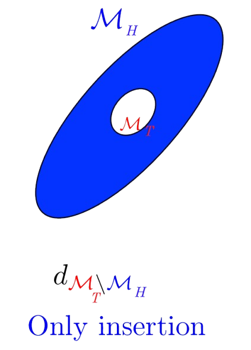
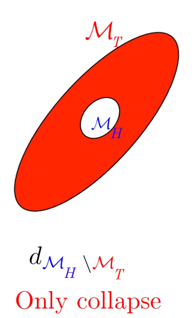
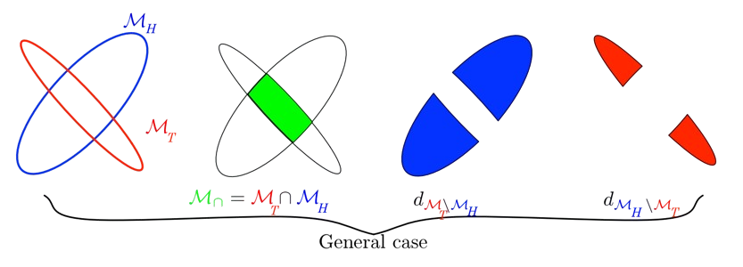

# Load Balancing

Une stratégie efficace de partitonnement devrait également faire en sorte d'équilibrer la charge de calcul entre les différents processeurs. Chaque travail de remaillage étant effectué indépendamment sur les différentes partitions, la performance globale d'une parallélisation de l'algorithme de remaillage sera limitée par la partition ayant la plus grosse charge computationnelle.

Cette charge de travail dépend des opérations de remaillage utilisées (insertion, collapse, swap, smoothing), de la métrique cible \\(\mathcal{M}(x)_{x \in \Omega}\\), du maillage initial \\(\mathcal{H}\\) et de sa métrique induite \\( (\mathcal{M} _{\mathcal{H}}(x)) _{x \in \Omega} \\) avec \\(\Omega\\) le domaine à remailler.

#### Remarque : 
En effet, si l'on considère que la métrique induite par le maillage initiale est égale en tout point du domaine \\(\Omega\\) à la métrique cible, i.e \\( (\mathcal{M} _{\mathcal{H}}(x)) _{x \in \Omega} = \mathcal{M}_T(x) _{x \in \Omega}\\) alors aucun travail de remaillage sera à effectuer.

Pour pouvoir définir le travail global de remaillage à effectuer, on procède à une estimation du travail élément par élément. On utilise toutefois une approche continue puisqu'on le rapelle les différents champs de métrique sont définis en tout point du domaine \\(\Omega\\).

#### Définition : Densité & Compléxité
Pour une métrique donnée  \\(\mathcal{M}(x)_{x \in \Omega}\\), la densité en chaque point du domaine \\(\Omega\\) est déterminée par : 

\\[ d_{\mathcal{M}}(x) = \sqrt{ det\mathcal{M}(x)}  \\]

La densité ponctuelle \\( d_{\mathcal{M}}(x)\\) influence directement le nombre d'éléments requis dans le maillage adapté : une densité plus élévée dans des régions spécifique du maillage entrainera un plus grand nombre d'élement dans ces zones. La compléxité d'un maillage \\( \mathcal{N} \\), définie comme le dual du nombre total de sommets N dans le maillage, est uen conséquence directe de la distribution de la densité de la métrique sur \\(\Omega\\).

\\[ \mathcal{N} =  \int_{x \in \Omega}^{} \sqrt{det \mathcal{M}(x) } \ dx = \int_{x \in \Omega}^{} d_{ \mathcal{M}}(x) \ dx \\]
            

On se propose de définir le travail de remaillage à effectuer par élément, le travail total sur le maillage étant la somme du travail à réaliser sur chaque élément.
Chaque élément \\(K\\) du maillage initial \\(\mathcal{H} \\) possède sa propre métrique induite \\( \mathcal{M}_ {\mathcal{H}}\\) réduite à l'élément K ainsi qu'une métrique cible également réduite à l'élément \\(K\\). Pour chacune des métriques, la métrique réduite à l'élément \\(K\\) est obtenue en effectuant la moyenne de ses métriques à chacun de ses sommets : 

\\[ \mathcal{M}|_ K = exp( \ \sum_{i=1}^{n} \ \frac{1}{n} \ ln( \ \mathcal{M}(x_i) \ ) \ )   \text{  where  } x_i \text{ are the vertices of } K \\] 

On peut également calculer l'intersection de la métrique cible et de la métrique induite :  \\[ \mathcal{M}_ { \cap }|_ K= \mathcal{M}_ {\mathcal{H}}|_ K \cap \mathcal{M}_ T |_ K\\]
On dénotera alors \\( d_{T} , d_{\mathcal{H}}, d_{\cap} \\)  les densités des métriques \\( \mathcal{M}_ T|_ K, \mathcal{M} _{\mathcal{H}} | _ K \\) et  \\( \mathcal{M} _ { \cap } | _ K \\) respectivement.
On analysera le travail dans deux configurations spécifiques et on généralisera à toutes configurations.

### Cas d'insertion : 

Prennons le cas, ou le maillage sera uniquement raffiné, la densité de points à insérer est \\( d_{\mathcal{M}_T \setminus  \mathcal{M} _{\mathcal{H}} }\\) d'où le travail à effectuer par élément est défini par : 

\\[ wrk(K) = \alpha |K|(d_{ T} - d_{\mathcal{H}})  = \alpha |K|(d_{\cap} - d_{\mathcal{H}}) \\] 

Avec : 
* \\(\alpha\\), le coût de l'opérateur d'insertion
* \\(|K|\\), le volume de l'élément
* \\( \mathcal{M} _ { \cap } =  \mathcal{M} _ T \\) dans ce cas précis

Il est important de garder en tête ici que la densité est inversement proportionnelle à la "taille" de l'ellipse représentant la métrique.

### Cas de Collapse : 

Dans le cas où le maillage est uniquement dégrossi, la densité des points à insérer devient : \\( d_{\mathcal{M} _{\mathcal{H}} \setminus \mathcal{M}_T   }\\)

\\[ wrk(K) = \beta |K|(d_{\mathcal{H}} - d_{ T})  = \beta |K|(d_{\cap} - d_{ T}) \\] 

Avec : 
* \\(\beta\\) le coût de l'opérateur d'insertion
* \\(|K|\\) le volume de l'élément
* \\( \mathcal{M} _ { \cap } =  \mathcal{M} _ {\mathcal{H}} \\) dans ce cas précis

### Cas General : 

Dans le cas général, il est possible d'avoir à insérer et à supprimmer localement des éléments de maillage pour l'adapatation d'un seul et même élément. En effet, cette situation survient, par exemple, lorsque deux métriques possèdent la même densité mais des axes orientés dans des directions différentes. 

Une telle configuration impliquant un raffinement dans une direction et un dégrossissement dans une autre. Le cas général englobe toutes les situations et la métrique d'intersection sert de base commune pour l'adapatation. La charge de travail est donc déterminée par la formule suivante : 

\\[ wrk(K)   = |K| \ ( \alpha  \ (d_{\cap} - d_{\mathcal{H}})  +  \beta  \ (d_{\cap} - d_{ T}) \ ) \\] 

\\(\\)\\(\\)

