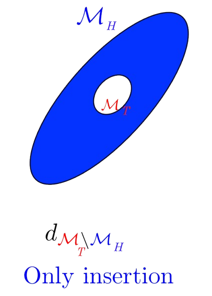
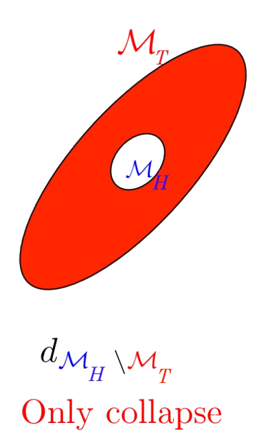
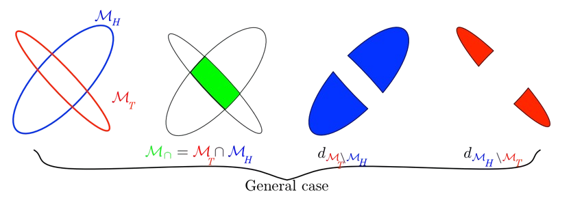

# Load Balancing

Une stratégie efficace de partitonnement devrait également faire en sorte d'équilibrer la charge de calcul entre les différents processeurs. Chaque travail de remaillage étant effectué indépendamment sur les différentes partitions, la performance globale d'une parallélisation de l'algorithme de remaillage sera limitée par la partition ayant la plus grosse charge computationnelle.

Cette charge de travail dépend des opérations de remaillage utilisées (insertion, collapse, swap, smoothing), de la métrique cible \\(\mathcal{M}(x)_{x \in \Omega}\\), du maillage initial \\(\mathcal{H}\\) et de sa métrique induite \\( (\mathcal{M} _{\mathcal{H}}(x)) _{x \in \Omega} \\) avec \\(\Omega\\) le domaine à remailler.

#### Remarque : 
Si l'on considère que la métrique induite par le maillage initiale est égale en tout point du domaine \\(\Omega\\) à la métrique cible, i.e \\( (\mathcal{M} _{\mathcal{H}}(x)) _{x \in \Omega} = \mathcal{M}_T(x) _{x \in \Omega}\\) alors aucun travail de remaillage sera à effectuer.

Pour pouvoir définir le travail global de remaillage à effectuer, on procède à une estimation du travail élément par élément. On utilise toutefois une approche continue puisqu'on le rapelle les différents champs de métrique sont définis en tout point du domaine \\(\Omega\\).

#### Définition : Densité & Compléxité
Pour une métrique donnée  \\(\mathcal{M}(x)_{x \in \Omega}\\), la densité en chaque point du domaine \\(\Omega\\) est déterminée par : 

\\[ d_{\mathcal{M}}(x) = \sqrt{ det\mathcal{M}(x)}  \\]

La densité ponctuelle \\( d_{\mathcal{M}}(x)\\) influence directement le nombre d'éléments requis dans le maillage adapté : une densité plus élévée dans des régions spécifique du maillage entrainera un plus grand nombre d'élement dans ces zones. La compléxité d'un maillage \\( \mathcal{N} \\), définie comme le dual du nombre total de sommets N dans le maillage, est uen conséquence directe de la distribution de la densité de la métrique sur \\(\Omega\\).

\\[ \mathcal{N} =  \int_{x \in \Omega}^{} \sqrt{det \mathcal{M}(x) } \ dx = \int_{x \in \Omega}^{} d_{ \mathcal{M}}(x) \ dx \\]
            

Pour tout élément \\(K\\) du maillage, il est possible d'y définir la métrique induite et la métrique cible. En effet, la métrique d'un élément n'est autre que la moyenne géométrique des métriques en ses sommets.

\\[ \mathcal{M}|_ K = exp( \ \sum_{i=1}^{n} \ \frac{1}{n} \ ln( \ \mathcal{M}(x_i) \ ) \ )   \text{  where  } x_i \text{ are the vertices of } K \\] 

On peut également calculer l'intersection de la métrique cible et de la métrique induite :  \\[ \mathcal{M}_ { \cap }|_ K= \mathcal{M}_ {\mathcal{H}}|_ K \cap \mathcal{M}_ T |_ K\\]
On dénotera alors \\( d_{T} , d_{\mathcal{H}}, d_{\cap} \\)  les densités des métriques \\( \mathcal{M}_ T|_ K, \mathcal{M} _{\mathcal{H}} | _ K \\) et  \\( \mathcal{M} _ { \cap } | _ K \\) respectivement.
On analysera le travail dans deux configurations spécifiques et on généralisera à toutes configurations.

### Cas d'insertion : 

Prennons le cas, ou le maillage sera uniquement raffiné, la densité de points à insérer est \\( d_{\mathcal{M}_T \setminus  \mathcal{M} _{\mathcal{H}} }\\) d'où le travail à effectuer par élément est défini par : 

\\[ wrk(K) = \alpha |K|(d_{ T} - d_{\mathcal{H}})  = \alpha |K|(d_{\cap} - d_{\mathcal{H}}) \\] 

Avec : 
* \\(\alpha\\), le coût de l'opérateur d'insertion
* \\(|K|\\), le volume de l'élément
* \\( \mathcal{M} _ { \cap } =  \mathcal{M} _ T \\) dans ce cas précis

Il est important de garder en tête ici que la densité est inversement proportionnelle à la "taille" de l'ellipse représentant la métrique.

### Cas de Collapse : 

Dans le cas où le maillage est uniquement dégrossi, la densité des points à insérer devient : \\( d_{\mathcal{M} _{\mathcal{H}} \setminus \mathcal{M}_T   }\\)

\\[ wrk(K) = \beta |K|(d_{\mathcal{H}} - d_{ T})  = \beta |K|(d_{\cap} - d_{ T}) \\] 

Avec : 
* \\(\beta\\) le coût de l'opérateur d'insertion
* \\(|K|\\) le volume de l'élément
* \\( \mathcal{M} _ { \cap } =  \mathcal{M} _ {\mathcal{H}} \\) dans ce cas précis

### Cas d'optimisation : 

A la fin du processus de remaillage, une phase d'optimisation est appliquée pour améliorer la qualité du maillage. Ainsi le travail d'optimisation effectué est proportionnel à la taille du maillage final  : 

\\[ wrk(K)  = \gamma \  |K| \ d_T \\]

Avec : 
* \\(\gamma\\) le coût de l'opérateur d'insertion
* \\(|K|\\) le volume de l'élément

### Cas Géneral : 

Dans le cas général, il est possible d'avoir à insérer et à supprimmer localement des éléments de maillage pour l'adapatation d'un seul et même élément.
Par exemple, si la métrique induite et la métrique cible possèdent la même densité mais des axes orientés dans des directions différentes. 

Le cas général englobe toutes les situations et la métrique d'intersection sert de base commune pour l'adapatation. La charge de travail est donc déterminée par la formule suivante : 

\\[ wrk(K)   = |K| \ ( \alpha  \ (d_{\cap} - d_{\mathcal{H}})  +  \beta  \ (d_{\cap} - d_{ T}) \  +  \gamma \  \ d_T )  \\] 

## Premiers Résultats et Observations
Après l'implémentation initiale des concepts de partitionnement et d'estimation de charge, les premiers cas tests ont permis de dégager des observations cruciales concernant le comportement des algorithmes et la nature des défis liés à l'équilibrage du temps de calcul des partitions.

Les expérimentations ont été menées à partir d'un maillage test cubique \\( \Omega = [0,1]^3\\), avec plusieurs paramètres réglables  : 

#### Configuration 3D:

* __Partitionneur__ : (MetisRecursive, MetisKway, Hilbert, Hilbert_Ball, BFS, BFSWR)
* \\(  M_H(x)_{x \ in \ \Omega } \\) (taille élément) 
* \\( M_T(x)_{x \ in \ \Omega} \\) (Iso / Aniso)
* Nombre de partitions = Nombre de threads
* Load Balancing : Oui/Non 

Pour pouvoir au mieux estimer les coûts en terme d'adaptation de maillage que représente chaque élément, il est nécessaire d'avoir une idée précise de ce que sont les coûts propres à chaque opération. Dans un premier temps, un profilage du code sur plusieurs configurations données permet de mettre en lumière plusieurs constats :  

| Opération \ Etat | Réussi | Echouée | Vérification|
|---------|---------|---------|---------|
| Split    |  10−5  |    10−6   | 10−8 |
| Collapse |  10−5  |   10−5    | 10−8 |
| Swap |  10−5  |   10−6    | 10−6 |
| Smooth |  10−9  |   10−9    | 10−9 |
 
L'opération de vérification qui prend le plus de temps est celle du swap.
Tous les couts liées aux opérations de smoothing peuvent être négligés la formule d'estimation de coût peut alors être simplifiée:  

\\[ wrk(K)   = |K| \ ( \alpha  \ (d_{\cap} - d_{\mathcal{H}})  +  \beta  \ (d_{\cap} - d_{ T}) \  )  \\] 

Pour pouvoir précisement évaluer le coût d'un split et d'un collapse, il est important de comprendre le fonctionnement réel de ces opérations... 
Un premier passage de split peut entrainer la formation de collapse et de swaps dans certaines parties du maillage pour différentes raisons.
De plus par nature de l'opération de spli, cell-ci entraine la création de nouvelles arêtes qui seront elles mêmes passées dans l'algorithme de remaillage. Les éléments découlant d'un split sont souvent de qualité suffisante et ne devraient pas être sujet à de nouvelles opérations de remaillage mais sont au moins passés pour vérification pour chaque opération.

Il découle que le coût total d'un split peut être déterminé par :

\\[ \alpha = \mathcal{C}_{split} + \beta * \rho _{collapse} + \phi * \rho _{swap} + \lambda * \overline{\mathcal{C} _{check}} \\]

Avec : 
* \\(\mathcal{C}_{split}\\) le coût unitaire d'un split
* \\( \beta \\) le coût total d'un collapse
* \\( \rho _{collapse} \\) la proprotion de collapse engendré par un split
* \\( \phi \\)  le coût total d'un swap 
* \\( \rho _{swap} \\) la proportion de swap engendré par un split
* \\( \lambda \\) Le nombre d'arêtes supplémentaires générées par un split
* \\( \overline{\mathcal{C} _{check}} \\) La somme des coûts de chaque vérification d'opération 

Dans de futures observations, mais pour simplifier les calculs on montrera que la proportion de swap générés par un split est négligeable.
De la même manière on peut définir le coût d'un collapse de la manière suivante : 

Ce qui nous amène à : ... 

<!-- 
Après l'implémentation initiale des concepts de partitionnement et d'estimation de charge, les premiers cas tests ont permis de dégager des observations cruciales concernant le comportement des algorithmes et la nature des défis liés à l'adaptation de maillage parallèle. Nous présentons ici les conclusions préliminaires tirées de ces expérimentations. 

Les expérimentations ont été menées sur une série de configuration en deux et trois dimensions. 

#### Configuration 2D : 
* \\( \Omega = [0,1]\times[0,1]\\)
* \\(\mathcal{M}_T =  
    \begin{bmatrix}0.01&0 \\\ 
    0 & 0.01\\end{bmatrix} \\) si \\( (x,y) \in \mathcal{C}(o= (0.3,0.3), r=0.1) \\)  

* \\( \mathcal{M}_T  = \mathcal{M} _{\mathcal{H}}\\) __sinon__
* Partitionneurs : __Hilbert, BFS , BFSWR__

#### Configuration 3D:

* \\( \Omega = [0,1]^3\\)
* \\(\mathcal{M}_T =  
    \begin{bmatrix}0.01&0&0\\\\
    0 & 0.01 & 0\\\\
    0 & 0 & 0.01\\end{bmatrix} \\) si \\( (x,y,z) \in \mathcal{C}(o= (0.3,0.3,0.3), r=0.1) \\)  

* \\( \mathcal{M}_T  = \mathcal{M} _{\mathcal{H}}\\) __sinon__
* Partitionneurs : __Hilbert, BFS , BFSWR__
* Nombre de partionneurs = 4 

### 1. Coûts Uniforme 
Les premières évaluations, où les coûts des opérateurs d'insertion \\(\alpha \\), de dégrossissement \\(\beta \\) et d'optimisation \\( \gamma \\) ont été fixés à 1, ont mis en lumière plusieurs tendances : 

* #### Déséquilibre de charge par nombre de sommets : 
  L'algorithme de partitionnement, tel qu'il est actuellement implémenté, génère des partitions déséquilibrées en termes de charge computationnelle effective.En effet, les zones identifiées comme nécessitant un travail de remaillage intense concentrent un nombre réduit de sommets par partition, mais un volume d'opérations élevé. Inversement, les partitions situées en dehors de ces zones à forte activité se retrouvent avec un nombre de sommets plus important, mais un travail de remaillage proportionnellement plus faible. Ce déséquilibre entraîne une conséquence majeure : les temps de vérification de faisabilité des opérations de remaillage sur les partitions à fort nombre de sommets deviennent supérieurs aux temps de réalisation des opérations de remaillage sur les partitions à faible nombre de sommets, créant ainsi des goulots d'étranglement.

* #### Propagation des opérations de remaillage : 
   Nous avons également découvert qu'une métrique spécifiquement calibrée pour induire uniquement des opérations de pur raffinement (split) engendraient de nouvelles opérations de remaillage par la suite. En effet les splits effectués créent de nouveaux éléments, qui ne respectent pas forcément les conditions de qualité minimum et par conséquent qui engendrent des opérations d'adaptation additionnelles. Cela est également le cas si l'on prend une métrique de degrossissement.

* #### Poids non Réalistes
  En plus de ne pas prendre en comtpe les opérations induites, les poids ne sont pas le reflet d'une réalité computationnelle. 

Ces premières observations mettent en évidence la nécessité de modifier l'algorithme d'estimation de la charge de travail de telle manière à ce que les poids soient le reflet du coût computationnel de l'opération auquel il est associé mais également du coût computationnel des autres opérations engendrées par l'effet d'une opération d'adaptation.De plus, les éléments où aucun travail ( au sens de la formule actuelle) n'est détecté représente tout de même en réalité une charge computationnelle. En effet, on vérifie pour toutes les arrêtes du maillage si elles devraient être adaptées. Il y a donc au minimun un coût de vérification d'opération par arête et donc plusieurs par élément.
\\(\\)

### 2. Coûts Réalistes

Dans le but de rendre compte des coût computationnel de chaque opération dans la fonction d'estimation de la charge de travail, il est impératif de profiler ces différentes fonctions. Pour chacune de ces opérations, plusieurs situations sont possibles, une opération peut être "réussie", "échouée" ou être une simple "vérification" qui n'aboutit à aucune modificaitions du maillage. Chacun de ces cas a été discuté dans la section opération de remaillage.

Après étude, sur plusieurs configurations différentes, on obtient les coût moyens suivants (secondes) : 

### a modifier une fois éxécuté sur cluster

| Opération \ Etat | Réussi | Echouée | Vérification|
|---------|---------|---------|---------|
| Split    |  1.40×10−5  |    6.67×10−6   | 4.04×10−8 |
| Collapse |   3.00×10−5  |   1.20×10−5    | 4.34×10−8 |
| Swap |  1.13×10−5  |   4.41×10−6    | 2.55×10−6 |
| Smooth |  7.67×10−9  |   7.69×10−9    | 2.44×10−9 |

On observe plusieurs choses très importantes, on voit qu'une opération réussie (split,collpase,swap) dure deux fois plus longtemps qu'une opération échouée et 1000 fois plus qu'une simple vérification. Le coût du Smooth est négligeable vis à vis des autres opérations. Il est également important d'estimer combien de fois sont réalisées chacune de ces sous-opérations lors de processus d'adaptation de maillage, et comment les opérations s'enchainent. Il faut notamment déterminer si certaines opérations, telles que des splits, peuvent entraîner d'autres opérations en cascade, augmentant ainsi le coût total du processus d'adaptation. 
 -->

