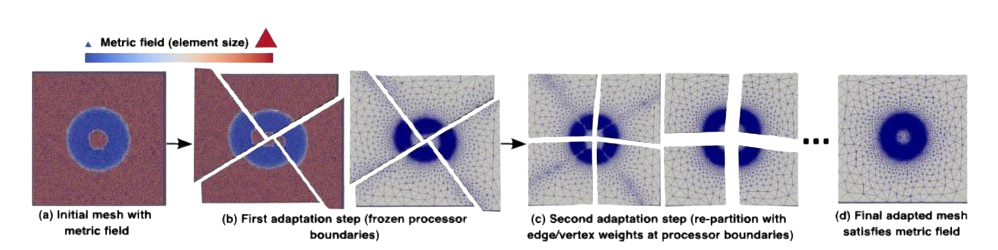
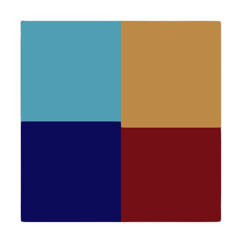
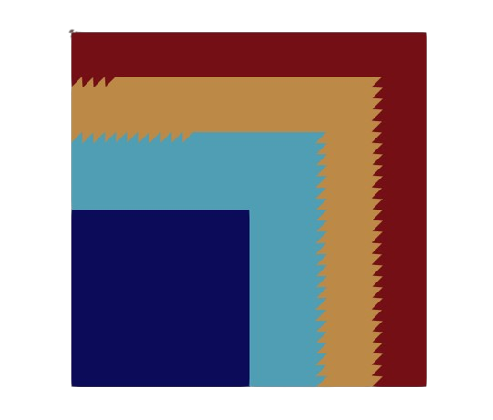
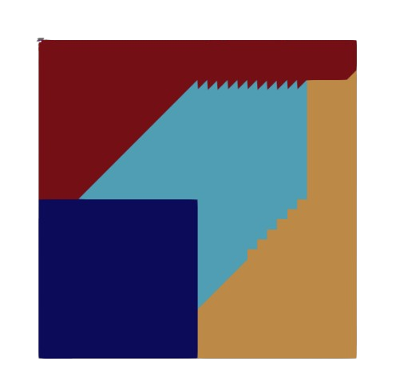

# Partitionners

Comme nous l'avons vu, la quantité de données induites par la résolution des équations de la CFD ainsi que la recherche de calcul de haute performance nous pousse à utiliser plusieurs unité de calcul. Pour cela il est impératif de partitionner le maillage sous-jacent au domaine de travail. Partitionner permet de diviser le domaine en autant de sous-domaines qu'il y a de coeurs disponibles, décomposant le problème initial en N sous-problèmes.

Un bon partitionnement repose sur trois critères essentiels : 

Reduction des interdépendances : Minimiser les arêtes ou faces partagées entre les sous-domaines afin de limiter les communications coûteuses entre les unités de calcul.

Preservation de la qualité : Assurer que la division ne dégrade pas la qualité des sous-maillages individuels

Equilibrage de charge : Distribuer équitablement la charge de travail computationnel entre tous les processeurs afin d'eviter les goulots d'étranglement et maximiser la performance parallèle (CF Load balancing)

### Partitionnement pour le Remaillage : Le Défi des Interfaces
Dans le cadre du remaillage, la gestion des interfaces entre les partitions est un défi majeur, car ces frontières doivent être adaptées sans compromettre la continuité du maillage global ni l'efficacité parallèle. Deux approches principales peuvent être distinguées pour adresser ce problème 

#### Two-Step process :
Cette méthode débute par un premier partitionnement du maillage. Les interfaces de ces partitions initiales sont alors "gelées", permettant à chaque processeur de remailler son sous-domaine interne de manière indépendante. Une fois cette première phase d'adaptation locale achevée, un second partitionnement est effectué sur l'ensemble du domaine, mais de manière à ce que les interfaces du premier partitionnement (celles qui étaient gelées) ne partagent aucun élément en commun avec les nouvelles interfaces du deuxième partitionnement. Cette stratégie garantit que la totalité du domaine, y compris les zones d'interface initialement gelées, soit effectivement remaillée, assurant ainsi une adaptation complète.

 

#### Hierarchical Interface Freezing Method :
Cette seconde approche est également basée sur le gel des interfaces, mais de manière itérative et hiérarchique. Le domaine est initialement partitionné et les interfaces sont gelées, permettant le remaillage indépendant de chaque sous-domaine. Une fois cette étape terminée, l'attention se porte sur les interfaces elles-mêmes : elles sont à leur tour partitionnées (en "gelant" les sous-interfaces nouvellement créées), puis remaillées. Ce processus de subdivision et de remaillage des interfaces peut être répété de manière récursive (gel des interfaces des interfaces, et ainsi de suite) jusqu'à atteindre un niveau de précision et de conformité satisfaisant sur l'ensemble des frontières.

Au-delà des stratégies de gestion des interfaces pour le remaillage parallèle, la problématique fondamentale de la division initiale d'un maillage en sous-domaines demeure. Cette tâche est assurée par les algorithmes de partitionnement dont les objectifs ont été discutés plus tôt. Nous allons introduire ici une séléction des partitionneurs utilisés au sein de Tucanos, ainsi que ceux implémentés dans le cadre des travaux de thèse. On effectuera une analyse comparative de leurs performances sur un cas test : 

Les deux partitionneurs ci-dessous sont basés sur une renumérotation préalable des sommets d'après une courbe de Hilbert. Chaque sommet du maillage se voit attribuer un indice de Hilbert en fonction de sa position spatiale sur la courbe. C'est une opération de compléxité linéaire, facilement parallélisable. Les partitionnements suivants se basent donc sur la liste des indices de Hilbert qui a la forme suivante : 

    [ Hilbert_1 = element_i, Hilbert_2 = element_j,  ... ]
Considérant qu'à l'issue de chaque partitionnement, on souhaite obtenir n partitons avec un nombre d'éléments par partition très proche, sans load Balancing.

#### 1. Hilbert Ball Partitionner
On commence par lister les éléments partageant le sommet n°1 d'après la liste d'indices de Hilbert, cette liste d'éléments appelée boule du sommet 1, chacun de ces éléments est ajouté à la partition n°1. Puis on fait de même avec le sommet n°2, on liste et on ajoute les éléments de la boule du sommet 2 qui n'ont pas encore été ajouté à une partition, et ainsi de suite ... A chaque fois que l'on ajoute un élément à une partition, on vérifie que le nombre d'éléments dans la partition_i que l'on est en train de remplir n'excède pas le montant d'éléments par partition voulu. Si tel est le cas alors l'élément est ajouté à la partition_i+1.

Voici un exemple du partitionnement obtenu sur un maillage carré en 2D via la méthode de Hilbert pour n=4 partitions: 

quality=2.13e-2

#### 2. BFS 

Cette méthode s'appuie non pas sur une renumérotation par Hilbert des sommets mais sur une renumérotation par éléments. On considère alors le premier élément de cette liste d'éléments, qu'on appellera élément __racine__, on ajoute chacun des éléments voisins à une file d'attente. Puis chaque élément de la file d'attente est ajouté à la partition courante et on ajoute également ses voisins (si ils n'ont pas déjà été assignés) à la file d'attente. La méthode avance donc par front. De la même manière que pour la méthode de la boule de Hilbert, chaque fois qu'un élément est ajouté à une partition, on s'assure que le montant d'élément dans la partition courante n'excède pas le nombre d'éléments voulu par partition.

Voici un exemple du partitionnement obtenu sur un maillage carré en 2D via la méthode BFS pour n=4 partitions: 

quality=6.52e-2

#### 3. BFS With Restart (BFSWR) 
Cette méthode utilise la même logique que celle du BFS, mais lorsque qu'une partition excède le nombre d'éléments par partition voulu, la file d'attente est vidée et le prochain élément __racine__ devient le dernier élément contenu dans la file avant d'être vidée.

Voici un exemple du partitionnement obtenu sur un maillage carré en 2D via la méthode BFS pour n=4 partitions:

quality=3.32e-2

#### 4. Metis 
