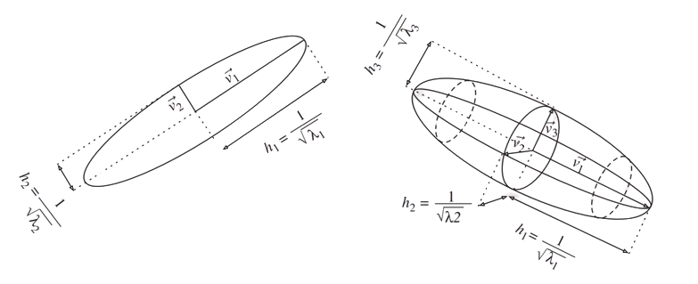
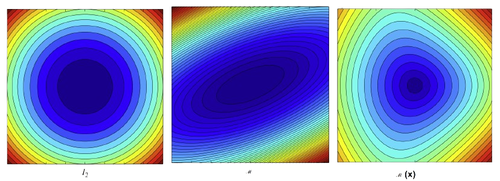
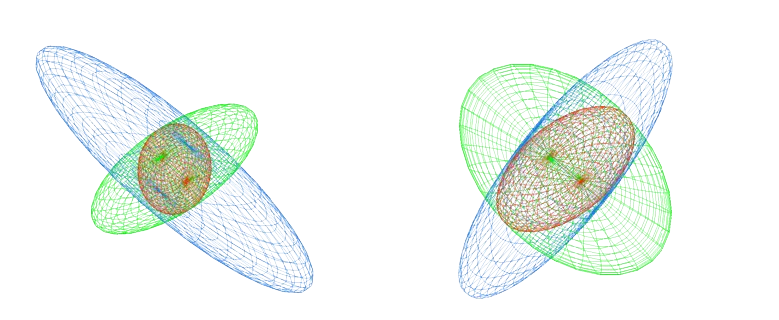
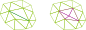

# Metric

### 3.1 Definition : Métrique
A **metric tensor** \\( \mathcal{M} \in \mathbb{R}^{n \times n} \\) is a symmetric positive definite matrix.

\\( \mathcal{M} \\) is always diagonalizable and can be decomposed as \\( \mathcal{M}= {^T}\mathcal{R} \Delta \mathcal{R} \\), where \\( \mathcal{R} \\) and \\( \Delta \\) respectively the matrices of the eigenvectors and eigenvalues of \\( \mathcal{M} \\).

From this definition, it follows that the **scalar product** of two vectors in \\( \mathbb{R}^n \\) can be defined with respect to a metric \\( \mathcal{M} \\) as follows :

\\[ <\textbf{u},\textbf{v}>_{\mathcal{M}} = <\textbf{u},\mathcal{M}\textbf{v} > = {^t}\textbf{u}\mathcal{M}\textbf{v} \\]

In this framework, the **Euclidean norm** of a vector\\( \textbf{ u} \text{ in } \mathbb{R}^n \\) according to \\( \mathcal{M} \\) is defined as:

\\[ \left\| \textbf{u} \right\| = \sqrt{<\textbf{u},\textbf{u} >_{\mathcal{M}} } = \sqrt{ \textbf{u}^{t} \mathcal{M} \textbf{u} } \\]

This formula allows us to measure the length of a vector \\( \textbf{u} \\) relative to a given metric \\( \mathcal{M} \\).

A metric \\( \mathcal{M} \\) can be geometrically represented by its associated **unit ball** defined by:

\\[\xi _{M} ={ p | \sqrt{ \textbf{op}^{t} \mathcal{M} \textbf{op} }=1| \} \\]

  

<figure style="text-align: center;">
  
  <figcaption>Figure 1: Geometric representation of the unit ball $ \xi _{M} , v_i $  are the eigenvectors of \mathcal{M} and \lambda_i = h_i^{-2} are the eigenvalues of \mathcal{M} [33] </figcaption>
</figure>

### 3.2 Definition : Euclidean metric space
A **Euclidean metric space** is a vector space equipped with a specific inner product \\( <.,.>_{\mathcal{M}} \\) defined by a metric tensor \\( \mathcal{M} \\). It is denoted by \\( ( \mathbb{R}^n, \mathcal{M} ) \\). \
The **distance** between two points \\( \textbf{p} \\) and \\( \textbf{q} \\) is given by :

\\[ d_{ \mathcal{M} }( \textbf{p},\textbf{q} ) = \sqrt{ \textbf{pq}^{t} \mathcal{M} \textbf{pq} } \\]

Finally, the **length** of a segment \\( \textbf{pq} \\)is the distance between its endpoints :

\\[ \mathcal{L}_ { \mathcal{M} } ( \textbf{pq} ) = d_{ \mathcal{M} } ( \textbf{p},\textbf{q} ) \\]

It is then possible to define **volumes** and **angles** within a Euclidean metric space. \
Let \\(K\\) be a bounded subset of \\( \mathbb{R}^n \\), the volume of an element \\(K\\)  in the metric \\( \mathcal{M} \\) is defined as :

\\[ |K| _{ \mathcal{M} } = \int _{K} \sqrt{det( \mathcal{M} )} |K| _{ \mathbb{I} _{n}} \\]

The **angle** between two vectors \\( \textbf{u} \\) and \\( \textbf{v} \\) is defined by the unique real number \\( \theta \in [ 0 , \pi ] \\) such that:

\\[ cos(\theta) = \frac{ <\textbf{u} , \textbf{v} > _{\mathcal{M}} }{||\textbf{u}|| _{\mathcal{M}} ||\textbf{v}|| _{\mathcal{M}}} \\]

### 3.2.1 Remark
If the metric defining the inner product is the identity matrix, \\( \mathcal{M} = \mathbb{I} _{n} \\), we obtain the standard **Euclidean space** \\( ( \mathbb{R}^n , \mathbb{I} _{n} ) \\) equipped with the canonical inner product.
\

### 3.3 Definition : Riemannian metric space
A **Riemannian metric space** is a continuous manifold \\( \Omega \subset \mathbb{R}^n \\) equipped with a smooth metric field \\( \mathcal{M}(.) \\), denoted by\\( \mathcal{M}(\textbf{x}) _{x \in \Omega} \\).

Unlike the Euclidean metric space, the distance between two points representing the shortest path is no longer a straight line but is instead given by a geodesic. However, in the context of mesh generation and adaptation, we are generally not concerned with the geodesic distance between two points, but rather with the length of a path defined by a mesh edge.

Specifically, in a Riemannian metric space \\( \mathcal{M}(\textbf{x}) _{x \in \Omega} \\), the length of an edge \\( \textbf{pq} \\) is calculated using the straight-line parametrization \\( \gamma(t) = \textbf{p} + t \textbf{ pq}, \text{ }t \in [0,1] \\) :

\\[ \mathcal{L}_ { \mathcal{M} } ( \textbf{pq} ) = \int_{0}^{1} || \gamma (t) || \ dt = \int_{0}^{1} \sqrt{\textbf{pq}^t \mathcal{ M }( \textbf{p}+t\textbf{pq} )\textbf{pq}} \ dt \\]

<figure style="text-align: center;">
  
  <figcaption> \\( \textbf{Figure 2:} \\)Isovalues of the function \\( f(x) = \mathcal{L}_m (ox) \\) for different spaces.
   
  Left: standard Euclidean space \\( ([-1,1]*[-1,1], \mathbb{I} _{2} ) \\)
   
  Middle: Euclidean metric space \\( ([-1,1]*[-1,1], \mathcal{M} ) \\)
   
  Right: Riemannian metric space \\( (\mathcal{M}(x))_{x \in [-1,1]^2} \\) </figcaption>
</figure>

Given an element \\( K \\) of \\(\Omega \in \mathcal{R}^d\\), the **volume** of \\( K \\) computed with respect to a Riemmanian Metric Space \\((\Omega,\mathcal{M}(x))\\) is :
\\[|K|_ {\mathcal{M}} = \int_{}^{} \sqrt{det \mathcal{M}(x) } \ dx\\]

 
 

#### 3.3.1 Riemmanian metric space decomposition and properties 
A Riemannian space \\(\mathcal{M} =  (\mathcal{M})(x)_{x \in \Omega} \\) can be written locally as :

\\[    \forall x \in \Omega       \mathcal{M} = d^{\frac{2}{3}}(x) \mathcal{R}(x)   \begin{bmatrix}r^{-\frac{2}{3}}(x)&&\\\\
     & r^{-\frac{2}{3}}(x) & \\\\
     & & r^{-\frac{2}{3}}(x) \end{bmatrix}   ^t\mathcal{R}(x)   \\] 

where :
* The density \\( d \\) is defined as: \\(d = (\lambda_1 \lambda_2 \lambda_3)^{\frac{1}{2}} = (h_1 h_2 h_3)^{-1}\\), where \\(\lambda_i\\) are the eigenvalues of \\(\mathcal{M}\\).
* The anisotropy quotients \\(r_i\\) are defined as : \\(r_i = \frac{h_i^3}{h_1 h_2 h_3}\\) .
* \\(R\\) is the eigenvector matrix of \\(\mathcal{M}\\) representing the orientation.

The metric tensor \\(\mathcal{M}\\) can thus be decomposed into three distinct components that drive the adaptation process:

Density  \\(d \\)  Controls only the local precision level of \\(\mathcal{M}\\). Increasing or decreasing \\(d \\) affects neither the anisotropic properties nor the orientation.

Anisotropy is defined by the anisotropy quotients \\(r_i \\) based on the size ratios \\( (h_i)\\).

Orientation is represented by the eigenvector matrix \\( \mathcal{R} \\) of \\( \mathcal{M} \\) .

#### 3.3.2 Complexity 
Finally, the complexity \\( \mathcal{C}\\) of the metric \\(  \mathcal{M} \\) is defined by the integral of the density over the domain:
 \\[  \mathcal{C}(\mathcal{M}) = \int_{\Omega} d(x) \ dx = \int_{\Omega} \sqrt{\det(\mathcal{M}(x))} \ dx \\]

### Definition 3.4 Unit Element with respect to \\(\mathcal{M}\\)
Let \\( K \\) be a simplex element in \\( \Omega\\) where d denotes the dimension. K is defined by its set of edges \\( \mathbf{(e_i)}_{i=1,..,d(d+1)/2}\\) is said to be unit with respect to a metric \\( \mathcal{M} \\) if the length of each of its edges is unit in this metric: 

\\[   \forall i= 1,...,\frac{d(d+1)}{2} \  \ \mathcal{ l_{M}}(\mathbf{e_i})= 1  \\]
<!-- \text{ with }  \mathcal{l_{M}}(\mathbf{e_i})=\sqrt{^t\mathbf{e_i}\mathcal{M}\mathbf{e_i}} -->
If all edges of \\(K\\) have unit length, then its volume  \\(  \mathbf{|K|_\mathcal{M}}\\)  in the metric   \\( \mathcal{M}\\) is constant and equal to: 

\\[  \mathbf{|K|_\mathcal{M} }= \frac{\sqrt{d+1}}{2^{d / 2}d!}  \text{  and  } \mathbf{|K|} _{I_d} = \frac{\sqrt{d+1}}{2^{d / 2}d!}  (det(\mathcal{M})^{ -\frac{1}{2}}) \\]

where \\( \mathbf{|K|} _{I_d}\\) denotes the Euclidean volume.

### 3.5 Duality Between Discrete and Continuous Entities
Let \\(\mathcal{M}\\) be a metric tensor, there exists an infinite, non-empty set of elements that are unit with respect to \\(\mathcal{M}\\).Conversely, let \\(K\\) be an element such that \\(|K| != 0\\), there exists a metric tensor \\(\mathcal{M}\\) for which this element \\(K\\) is unit.

The consequence of this proposition is that the notion of a "unit" element relative to \\(\mathcal{M}\\) allows for the definition of equivalence classes of discrete elements. Thus, within the framework of continuous meshing, a metric tensor \\(\mathcal{M}\\) is itself referred to as a continuous element. It is used to model the set of all discrete elements that are unit for \\(\mathcal{M}\\). This framework makes it possible for a discrete simplex mesh to be fully described by a Riemmanian metric space.

However the existence of a perfect unit mesh for a given Riemannian metric space is not guaranteed. Therefore, the concept of a unit mesh must be extended: 

A discrete mesh \\(\mathcal{H}\\)  of a domain \\( \Omega \subset R^{n}\\)  is considered a unit mesh with respect to a Riemannian metric space \\( \mathbf{M}= (\mathcal{M})(x)_{x \in \Omega} \\) if all its elements are quasi-unit.

A tetrahedron \\( K \\) is said to be quasi-unit if: 

\\[   \forall i= 1,...,6, \mathcal{l_{M}}(\mathbf{e_i}) \in [\frac{1}{\sqrt{2}}, \sqrt{2}]\\] and if its volume is unitary.

Consequently, the adapted mesh is uniform and isotropic in the Riemannian space, while being anisotropic in the Euclidean space.

#### 3.5.1 Quality function
The relaxed definition of a unit mesh, which allows for quasi-unit elements, may lead to non-conforming or degenerate elements, such as those with zero volume (see [33] for examples). Consequently, controlling edge lengths alone is insufficient; the element volume must also be monitored.The strategy employed here is to control the ratio between the sum of the squared edge lengths and the volume of the element. All geometric quantities are computed within the prescribed metric \\(\mathcal{M}\\). This ratio defines a quality measure \\(Q_\mathcal{M}\\) that evaluates the regularity of a tetrahedron \\(K\\) in the metric space:

\\[Q_{\mathcal{M}}(K) = \frac{36\sqrt[3]{3} \cdot |K|_ {\mathcal{M}}^{\frac{2}{3}}}{\sum_{i=1}^{6} \ell_{\mathcal{M}}^2(\mathbf{e}_i)} \in [0, 1] \\]
 <!-- compute geometric quantities directly associated with this continuous element. -->

## Metric Operations
Constructing a metric suitable for remeshing often requires combining information from various sources or imposing specific constraints, such as minimum/maximum edge lengths or controlled metric gradation across the mesh. Therefore, it is essential to define the mathematical operations that can be performed on metrics.

### Metric Intersection : 
Given two metric \\( \mathcal{M}_ 1 \\) and \\( \mathcal{M}_ 2 \\), their intersection \\( \mathcal{M}_ {1 \cap 2}\\) corresponds to a metric that imposes the largest sizes in all directions that remain smaller than those prescribed by both  \\(\mathcal M_1\\) and \\(\mathcal M_2\\). Geometrically, the ellipse associated with the intersection metric \\( \mathcal{M}_ {1 \cap 2}\\) is the largest ellipse contained within the intersection of the ellipses of\\( \mathcal{M}_ 1 \\) and \\( \mathcal{M}_ 2 \\).
\\[ \mathcal M_{1 \cap 2} = \arg \min \{ \det (\mathcal M) |  \mathcal M \in \mathcal S^+ t.q. \mathcal M\ge \mathcal M_1, \mathcal M\ge \mathcal M_2\} \\] 

<figure style="text-align: center;">
  
  <figcaption>  $$ \text{Intersection of two metrics; the intersected metric } \mathcal{M}_{1 \cap 2}$$. </figcaption>
</figure>

The intersection operation is performed as follows:

Let \\( P = (e_0 | ... | e_d) \\) be the generalized eigenvectors of the pair\\( (M_0, M_1) \\) :

\\[ \mathcal M_0 \mathcal P = \Lambda \mathcal M_1 \mathcal P \\]

Then, each metric can be expressed as:

\\[ \mathcal M_i = \mathcal P^{-1, T} \Lambda^{(i)} \mathcal P^{(-1)} \\]

where \\( \Lambda^{(i)}{jk} = e_j^T \mathcal M_i e_k \delta_{jk} \\).

The intersection is then defined as:

\\[ \mathcal M_0 \cap \mathcal M_1 = \mathcal P^{-1, T} \Lambda^{(i,j)} \mathcal P^{-1} \\]

with \\( \Lambda^{(i,j)}{jk} = \max(\Lambda^{(i)}{jk}, \Lambda^{(j)}_{jk}) \\)

## Metric Gradation

It is often desirable to control the evolution of edge lengths from one element to another. This concept can be translated into constraints on the variation of the metric field (see *Size gradation control of anisotropic meshes*, F. Alauzet, 2010). The approach can be summarized as follows:

* The gradation along an edge\\( \mathbf e_{i,j} = \mathbf x_j - \mathbf x_i \\) is defined by (with \\( a = l_{\mathcal M_i} (\mathbf e_{i,j}) / l_{\mathcal M_j} (\mathbf e_{i,j}) \\) )
\\[ \max\left(a, \frac{1}{a} \right)^\frac{1}{l_\mathcal M(\mathbf e_{i,j})} \\]

* Given a metric \\( \mathcal M(\mathbf x) = R^T \ diag(s_1^2, \cdots s_d^2) \ R \\), it is possible to propagate a field to any position  \\( \mathbf y \\) as :
\\[ \mathcal M_s(\mathbf x, \mathbf y) = R^T \  diag(\eta_1^2 s_1^2, \cdots \eta_d^2s_d^2) \  R \\]
where \\( \eta_i = 1 + s_i \|\mathbf y - \mathbf x\|_2\log(\beta) \\) ensuring that the gradation along \\( \mathbf y - \mathbf x \\) is bounded by \\( \beta \\).

* In practice, a maximum gradation is imposed along an edge \\( \mathbf e_{i,j} = \mathbf x_j - \mathbf x_i \\), by modifying \\( \mathcal M_j \\) as:
\\[ \widetilde{\mathcal M_j} = \mathcal M_j \cap \mathcal M_s(\mathbf x_i, \mathbf x_j) \\]
et
\\[ \widetilde{\mathcal M_i} = \mathcal M_i \cap \mathcal M_s(\mathbf x_j, \mathbf x_i) \\]

* Achieving a global maximum gradation across all mesh edges would theoretically require \\( O(N^2) \\) operations. In practice, the above operation is applied iteratively over a limited number of passes across the set of mesh edges.

A discrete simplex mesh can be fully described by a Riemannian metric space. Such duality relies on
the notion of unit elements. Once we define the unit element notion, we can generalize the unit notion
to the mesh and then define a duality between the mesh and the continuous metric space. Then we
can refer to a mesh as its metric field. Furthermore we can use the existing metric operations and
invariants in the Riemannian space to control the interpolation error. Such mathematical framework
was thoroughly established in ([33],[34]). We will hereby recall the most important aspects of the
continuous mesh theory.

To generate anisotropic meshes that adapt to the flow physics, it is necessary to prescribe element sizes and orientations at every point in the domain. This is made possible by using the Riemannian space defined earlier.

The core idea is to generate a unit mesh with respect to the metric derived from the error indicator. A tetrahedron\\( K \\), ddefined by its set of edges \\( \mathbf{(e_i)}_{i=1..6}\\)is said to be unit with respect to a metric \\( \mathcal{M} \\) if the length of each of its edges is unity in this metric: 

\\[   \forall i= 1,...,6, \mathcal{l_{M}}(\mathbf{e_i})= 1 \text{ with }  \mathcal{l_{M}}(\mathbf{e_i})=\sqrt{^t\mathbf{e_i}\mathcal{M}\mathbf{e_i}} \\]

If all edges of \\(K\\) have unit length, then its volume  \\(  \mathbf{|K|_\mathcal{M}}\\)  in the metric   \\( \mathcal{M}\\) is constant and equal to: 

\\[  \mathbf{|K|_\mathcal{M} }= \frac{\sqrt{2}}{12}  \text{  and  } \mathbf{|K|} = \frac{\sqrt{2}}{12} (det(\mathcal{M}))^{ -\frac{1}{2}} \\]

where \\( \mathbf{|K|}\\) denotes the Euclidean volume.

The existence of a perfect unit mesh for a given Riemannian metric space is not guaranteed. Therefore, the concept of a unit mesh must be extended: a discrete mesh \\(\mathcal{H}\\)  of a domain \\( \Omega \subset R^{n}\\)  is considered a unit mesh with respect to a Riemannian metric space \\( \mathbf{M}= (\mathcal{M})(x)_{x \in \Omega} \\) if all its elements are quasi-unit. A tetrahedron \\( K \\) is said to be quasi-unit if: 

\\[   \forall i= 1,...,6, \mathcal{l_{M}}(\mathbf{e_i}) \in [\frac{1}{\sqrt{2}}, \sqrt{2}]\\] and if its volume is unitary.

Consequently, the adapted mesh is uniform and isotropic in the Riemannian space, while being anisotropic in the Euclidean space.

### Error Control and Continuous Formulation in Mesh Adaptation

In mesh adaptation, the goal is to control the interpolation error between an exact solution \\( u \\)  and its linear reconstruction on a mesh \\( \mathcal{H}\\) : 

\\[  |u- \Pi_h u |_{L^p(\Omega_h)}\\] 

where : 
* \\(\Pi_h u\\) is the linear interpolant on the discrete mesh.
* \\((\Omega_h)\\) is the meshed domain.

This formulation is discrete and explicitly depends on the mesh, which makes global optimization complex. By using a continuous metric field \\( \mathcal{M}(x) \\),one can define a continuous interpolation error associated with the metric \\( \mathcal{M}(x) \\)independent of any specific discrete mesh:

\\[  |u- \Pi_{\mathcal{M}} u |_{L^p(\Omega_h)}\\] 

For a quadratic function \\(u \\), the following theorem holds:

#### Théorème 3.1. 
For any element \\(K\\) that is unit with respect to  \\(\mathcal{M} \\) , the \\(L^1 \\)   interpolation error of \\( u \\)is independent of the element's shape and depends solely on the Hessian \\(\mathbf{H} \\) of \\(u \\) and the metric \\(\mathcal{M}\\).
In 3D, for all tetrahedra \\(K \\) that are unit with respect to \\(\mathcal{M}\\) , the following equality holds: :

\\[\|u - \Pi_h u\|_{L^1(K)} = \frac{\sqrt{2}}{240} \det \left( \mathcal{M}^{-\frac{1}{2}} \right) \text{trace} \left( \mathcal{M}^{-\frac{1}{2}} \mathbf{H} \mathcal{M}^{-\frac{1}{2}} \right)\\]

The error is well-defined for a quadratic solution on an element K, however, since a metric is defined at every point in the domain\\( x \in \Omega \\)it is necessary to define the error throughout the entire domain :

#### Théorème 3.2. 

Let\\(u\\)be a twice continuously differentiable function on a domain \\( \Omega \\) and let \\( \mathcal{M}(x)_{x \in \Omega} \\)  be a continuous mesh of  \\( \Omega\\).

There exists a unique function\\( \pi_M \\)  such that:
\\[ \forall a \in \Omega, |u - \pi_M u|(a) = \frac{\|u_Q - \Pi_h u_Q\|_{L^1(K)}}{|K|} = \frac{1}{20} \text{trace} \left( \mathcal{M}(a)^{-\frac{1}{2}} |\mathbf{H}(a)| \mathcal{M}(a)^{-\frac{1}{2}} \right) \\] 
for any element K that is unit with respect to \\(\mathcal{M}(a)\\) , where \\( u_Q\\)  is the quadratic model of \\(u\\) at point\\( a \\).

This theorem emphasizes another discrete-continuous duality by highlighting a continuous equivalent of the interpolation error.

For this reason, the following formalism is proposed

\\( \pi_M\\)  is called the continuous linear interpolant, and \\( |u - \pi_M u| \\)  represents the continuous dual of the interpolation error.

The local interpolation error becomes global when the mesh is unit with respect to a constant metric tensor (which does not necessarily imply that the mesh is uniform) and when the function is quadratic. In this specific case, neglecting boundary discretization errors, we obtain the following equality: 

\\[ \|u - \Pi_h u\|_{L^1(\Omega_h)} = \|u - \pi_M u\| _{ L^1(\Omega) }\\]

for all meshes \\( \mathcal{H} \\) that are unit with respect to\\( \mathcal{M}(x)_{x \in \Omega} \\) 

### 3.4  Optimal Control of the \\(L^p\\)-norm Interpolation Error

In its most general form, the mesh adaptation problem consists of finding the mesh \\(\mathcal{H}\\) of a domain \\( \Omega \\) that minimizes a given error for a defined function \\( u \\). 

For the sake of simplicity, we consider here the linear interpolation error \\( |u - \Pi_h u | \\) controlled in the \\(L^p\\)norm, although other norms may also be used. The problem is thus posed a priori:
Find \\( H_{opt} \\) with \\(N\\) vertices such that:
\\[E_{L^p}(H_{opt}) = \min_{H} \|u - \Pi_h u\|_{L^p(\Omega_h)} \quad (P)\\]

Problem \\((P)\\) is a global combinatorial problem that proves to be insoluble in practice. Indeed, it would require the simultaneous optimization of both the mesh topology and the vertex positions.

Consequently, simpler sub-problems are considered to approximate the solution. A common simplification consists of performing a local error analysis instead of addressing the global problem. A first set of methods focuses on deducing the optimal shape of the elements. A second set involves deriving a local bound for the interpolation error.

This bound is then transformed into a metric-based estimate. Direct error minimization can also be considered by using the interpolation error itself as a cost function within the mesh generator.

All these strategies share a common trait: they solve a local problem, as they operate in the neighborhood of a single element. Consequently, such error minimizations are equivalent to a gradient descent algorithm that only converges toward a local minimum with poor convergence properties. This drawback arises from the fact that the minimization is performed directly on a discrete mesh.

 
 

## 3.5 Optimal Control of the \\(L^p\\)-norm Interpolation Error in a Continuous Framework 

We propose to address the resolution of \\((P)\\) within a continuous framework. Consequently, \\((P)\\) is reformulated as a continuous optimization problem where the discrete interpolation error is replaced by its continuous equivalent:

Find \\(M_{opt}\\) with a complexity of \\(N\\) such that:
\\[E_{L^p}(M_{opt}) = \min_{M} \|u - \pi_M u\|_{L^p(\Omega)}\\]

By using the definition of the continuous linear interpolant\\(\pi_M\\), it is possible to pose a well-posed global optimization problem to find the optimal continuous mesh that minimizes the \\(L^p\\) norm continuous interpolation error:

Find \\(M_{L^p} = \min_{M} E_{L^p}(M)\\), where:

\\[E_{L^p}(M) = \left( \int_{\Omega} (u(x) - \pi_M u(x))^p , dx \right)^{1/p} = \left( \int_{\Omega} \text{trace} \left( M(x)^{-1/2} |H_u(x)| M(x)^{-1/2} \right)^p  dx \right)^{1/p} \quad (4)\\]

subject to the constraint: \\[\mathcal{C}(M) = \int_{\Omega} d(x) \ dx = N\\]

The complexity constraint is added to avoid the trivial solution where all sizes \\((h_i)_{i=1,3}\\) would be zero, which would result in zero error. Unlike a discrete analysis, this problem can be solved globally using the calculus of variations, which is well-defined over the space of continuous meshes.

### Theorem 3.3
Let \\(u\\) be a twice continuously differentiable function defined on \\(\Omega \subset \mathbb{R}^3\\), and \\(H_u\\) its Hessian. The optimal continuous mesh \\(M_{L^p}(u) = (M_{L^p}(x))_{x \in \Omega}\\) that locally minimizes Problem (4) is given by:

\\[M_{L^p}(x) = N^{\frac{2}{3}} \left( \int_{\Omega} \det(|H_u(\bar{x})|)^{\frac{p}{2p+3}} d\bar{x} \right)^{-\frac{2}{3}} \times \det(|H_u(x)|)^{-\frac{1}{2p+3}} |H_u(x)| \quad (5)\\]

It satisfies the following properties:
* L'Uniqueness : \\(M_{L^p}(u)\\) is unique.
* Local Alignment: \\(M_{L^p}(u)\\) is locally aligned with the eigenvector basis of \\(H_u\\) and possesses the same anisotropy ratios as \\(H_u\\).
* Optimal Error Bound: \\(M_{L^p}(u)\\) provides an explicit optimal bound for the \\(L^p\\)norm interpolation error: :

\\[ \|u - \pi_{M_{L^p}} u\|_ {L^p(\Omega)} = 3 N^{-\frac{2}{3}} \left( \int_{\Omega} \det(|H_u|)^{\frac{p}{2p+3}} \right)^{\frac{2p+3}{3p}}\\]

It thus appears that the search for the optimal mesh cannot be dissociated from the metric from which it originates; the latter acts as the pivot between the theoretical minimization of error and the geometric construction of a discrete and efficient computational domain.

### 4. Mesh Adaptation for Steady Flows

The transition from a theoretical error analysis to a numerical application in Fluid Dynamics requires a reformulation of the optimization problem. While pure theory defines the optimal metric as an ideal tensor, the operational challenge lies in the effective generation of a mesh whose density and anisotropy minimize the approximation error.

In numerical simulations, the exact solution \\(u\\) is, by definition, unknown. 

Problem \\((P)\\) therefore transposed to minimize the error between \\(u \text{ and } u_h \\) in the \\(  |L^{p}| \\) norm .

This transition requires coupling continuous mesh theory with error estimators capable of linking the approximation error to the local interpolation error.

### 4.1. Adaptation Strategies

Two distinct methodological approaches are used to drive anisotropy:

Feature-based approach :This aims to optimize the mesh to capture all physical structures of a specific sensor (e.g., pressure, Mach number). The use of the \\(L^p\\)norm is crucial here for capturing multi-scale phenomena, allowing for the refinement of structures whose amplitude is several orders of magnitude smaller than the primary scales.

Goal-oriented approach: This focuses the error reduction effort on a specific scalar functional of interest (e.g., lift, drag), although prescribing anisotropy in this context is mathematically more complex.

### 4.3. Iterative Procedure and Convergence

Since mesh adaptation is intrinsically non-linear, its resolution relies on an iterative loop aimed at the convergence of the mesh-solution pair. The process follows a rigorous sequence:

Flow resolution on a given mesh \\(H_i\\).
Estimation of the optimal metric \\(M_{L^p}\\)from the computed solution (generally via Hessian recovery).
Metric field gradation to ensure geometric regularity (smoothing).
Generation of a new mesh \\(H_{i+1}\\)  that adheres to the prescribed metric.

This strategy not only allows for the capture of singularities and strong discontinuities (shocks, boundary layers) but also ensures the recovery of the numerical scheme's theoretical convergence order, which is often degraded on non-adapted meshes.

We no longer seek merely to mathematically define an optimal metric, but to physically construct the resulting optimal mesh to solve complex fluid dynamics problems.

<!-- L'adaptation basée sur les caractéristiques (Feature-based) : On cherche le meilleur maillage pour capturer les variations d'un capteur physique donné (vitesse, pression, etc.).
L'adaptation orientée par l'objectif (Goal-oriented) : On optimise le maillage pour observer une fonctionnelle scalaire précise (par exemple, la traînée ou la portance d'une aile).
Problématiques et Motivations
Bien que l'efficacité de l'anisotropie soit prouvée, le passage aux solutions numériques (où la solution exacte \\(u\\) est inconnue) soulève des défis :Erreur d'approximation : On cherche à minimiser \\(\|u - u_h\|_ {L^p}\\) au lieu de l'erreur d'interpolation pure.Capture multi-échelles : L'utilisation de la norme \\(L^p\\) (au lieu de \\(L^\infty\\)) est indispensable pour capturer des phénomènes dont l'amplitude est parfois 1000 fois plus faible que les structures principales, sans avoir besoin de fixer arbitrairement une taille de maille minimale.Convergence théorique : L'adaptation permet de retrouver un ordre de convergence de 2 (souvent perdu sur des maillages uniformes en présence de chocs ou de forts gradients), ce qui valide la qualité du calcul.L'algorithme d'adaptationL'adaptation est un processus non-linéaire résolu par une boucle itérative. On ne se contente pas de calculer une métrique ; on génère un nouveau maillage à chaque étape pour converger vers le couple maillage-solution optimal.La boucle type (Algorithme 2) :Calcul : Résolution de l'écoulement sur le maillage actuel.Métrique : Calcul de la métrique \\(M_{L^p}\\) basée sur l'estimation d'erreur.Gradation : Lissage de la métrique pour éviter des variations de taille trop brutales entre voisins.Génération : Création d'un nouveau maillage adapté à cette métrique.Interpolation : Transfert de la solution précédente sur le nouveau maillage pour redémarrer le calcul. -->

<b>Algorithm:</b> Mesh Adaptation Loop for Steady Flows  

<b>Input:</b> Initial mesh and solution \\((H_0, S_0^0)\\), target complexity \\(N\\) 
<b>Output:</b> Adapted mesh and solution  

<ol>
Compute solution \\(S_i\\) using the flow solver from \\( (H_i, S_i^0) \\)
If \\(i = n_{\text{adap}}\\) , <b>break</b> 
Compute metric \\(M_{L^p,i} \text{from} (H_i, S_i)\\)
Apply metric gradation to obtain \\(\tilde{M}_{L^p,i}\\)
Generate adapted mesh \\(H_{i+1}\\)from \\((H_i, \tilde{M}_{L^p,i})\\)
Interpolate solution to obtain \\(S_{i+1}^0\\) from \\((H_{i+1}, H_i, S_i)\\)
</ol>

 

\\(\\) \\(\\) \\(\\) \\(\\) \\(\\) 

### Definition: Cavity

Given a mesh entity \\( e \\) (a vertex or an edge in this case), the cavity \\( \mathcal{C}(e) \\)is the set of mesh elements that contain the entity \\( e \\).

A cavity \\( \mathcal{C}(e) \\) can be "re-filled" from a vertex \\( \mathbf v \\) as the set of elements created from \\( \mathbf v \\) and the faces of the cavity boundary \\( \partial \mathcal{C}(e) \\) (outward-oriented).

\\[ \mathcal F(\mathbf v,C(e))= { K=(\mathbf v, \mathbf g_1, \cdots, \mathbf g_d) | g = (\mathbf g_1, \cdots, \mathbf g_d) \in \partial C(e), \mathbf v \notin g} \\]

### Definition: Swap

<figure style="text-align: center;">
  
</figure>

The __swap__ operation aims at improving the quality of the elements. It locally modifies the connectivity of a mesh without adding or removing vertices.

This operation may fail for several reasons. It is topologically impossible if the edge to be modified has only one adjacent element or if it lies on a fixed boundary. Similarly, the operation fails if the vertex topology is incompatible.

These 3 criteria have to be assessed to determine if a __swap__ operation is accepted or not.

This operation may fail for several reasons. It is topologically impossible if the edge to be modified has only one adjacent element or if it lies on a fixed boundary. Similarly, the operation fails if the vertex topology is incompatible.

A swap is also rejected when quality and geometric constraints are not met. The operation is not performed if the current mesh quality is already above the required threshold, or if it risks compromising surface regularity by creating, for instance, an excessively large normal angle. Specifically, the new elements resulting from the swap must respect a minimum quality and predefined edge length limits. Finally, the swap is considered a failure if the proposed modification does not change the cavity connectivit

It can however introduce:

* "long" or "short" edges

* a poor representation of the geometry that will be difficult to recover later

* inconsistent tagging

These three criteria must be assessed to determine if a swap operation is accepted or not.

### Definition: Split

<figure style="text-align: center;">
  
</figure>

The __split__ operation aims at splitting "long" edges. It is applied to edges whose length (in metric space) is larger than \\(l_0 > \sqrt{2}\\). 

For a split to be performed on an edge deemed too long, it must not be located on a fixed boundary, and the modification must not result in poor mesh quality or excessively short edges. If any of these conditions are not met, the operation fails. The operation is validated and executed only if all conditions are respected and if it effectively improves the mesh quality. 

It can however introduce
- "short" edges
- element of low quality (including invalid elements)

These 2 criteria have to be assessed to determine if a __split__ operation is accepted or not
When introducing new vertices on boundaries, a projection step is required to ensure the consistency with the CAD model.

### Definition: Collapse

<figure style="text-align: center;">
  
</figure>

The __collapse__ operation aims at removing "small" edges. It is applied to edges whose length (in metric space) is smaller than \\( l_0 < 1/\sqrt{2} \\). 

It can however introduce
- "long" edges
- element of low quality (including invalid elements)
- a poor representation of the geometry that will be difficult to recovered later

These 3 criteria have to be assessed to determine if a __collapse__ operation is accepted or not.

Just as with a split, a collapse on an edge deemed too short can only be performed under certain conditions. The operation is first subject to feasibility checks. It fails if the edge is on a fixed boundary, if the modification risks degrading the resulting mesh quality, or if it leads to an irregular vertex geometry.

### Definition: Smooth

The smoothing operation aims at improving the quality of the elements by moving vertices to some average of the locations of its neighbors.

In order to have a consistent smoothing on the boundaries of the computational domain, only the neighbors tagged on the same topological entity (or one of its children) are considered for smoothing. A projection step is still required for boundary vertices to ensure consistency with the CAD model.

