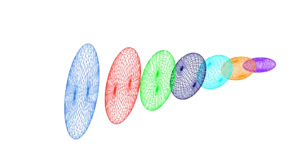
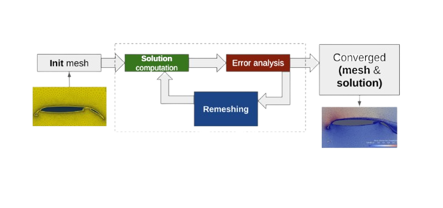
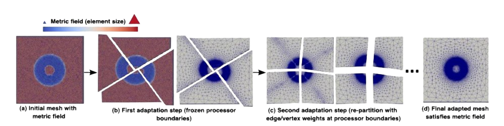
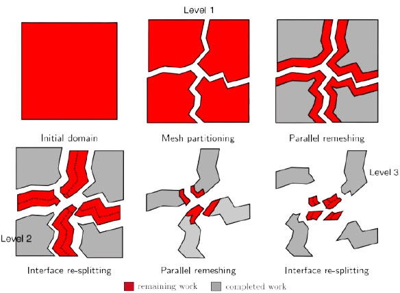

# Anisotropic Mesh Adaptation 
### 3.1 Definition : Metric
A **metric tensor** \\( \mathcal{M} \in \mathbb{R}^{n \times n} \\) is a symmetric positive definite matrix.

\\( \mathcal{M} \\) is always diagonalizable and can be decomposed as \\( \mathcal{M}= {^T}\mathcal{R} \Delta \mathcal{R} \\), where \\( \mathcal{R} \\) and \\( \Delta \\) respectively the matrices of the eigenvectors and eigenvalues of \\( \mathcal{M} \\).

From this definition, it follows that the **scalar product** of two vectors in \\( \mathbb{R}^n \\) can be defined with respect to a metric \\( \mathcal{M} \\) as follows :

\\[ <\textbf{u},\textbf{v}>_{\mathcal{M}} = <\textbf{u},\mathcal{M}\textbf{v} > = {^t}\textbf{u}\mathcal{M}\textbf{v} \\]

In this framework, the **Euclidean norm** of a vector\\( \textbf{ u} \text{ in } \mathbb{R}^n \\) according to \\( \mathcal{M} \\) is defined as:

\\[ \left\| \textbf{u} \right\| = \sqrt{<\textbf{u},\textbf{u} >_{\mathcal{M}} } = \sqrt{ \textbf{u}^{t} \mathcal{M} \textbf{u} } \\]

This formula allows us to measure the length of a vector \\( \textbf{u} \\) relative to a given metric \\( \mathcal{M} \\).

A metric \\( \mathcal{M} \\) can be geometrically represented by its associated **unit ball** defined by:

\\[\xi _{M} ={ p | \sqrt{ \textbf{op}^{t} \mathcal{M} \textbf{op} }=1| \} \\]

  

<figure style="text-align: center;">
  
  <figcaption>Figure 1: Geometric representation of the unit ball $$\xi _{M} , v_i $$  are the eigenvectors of $$\mathcal{M} $$and $$\lambda_i = h_i^{-2}$$ are the eigenvalues of $$\mathcal{M}$$ [33] </figcaption>
</figure>

### 3.2 Definition : Euclidean metric space
A **Euclidean metric space** is a vector space equipped with a specific inner product \\( <.,.>_{\mathcal{M}} \\) defined by a metric tensor \\( \mathcal{M} \\). It is denoted by \\( ( \mathbb{R}^n, \mathcal{M} ) \\). \
The **distance** between two points \\( \textbf{p} \\) and \\( \textbf{q} \\) is given by :

\\[ d_{ \mathcal{M} }( \textbf{p},\textbf{q} ) = \sqrt{ \textbf{pq}^{t} \mathcal{M} \textbf{pq} } \\]

Finally, the **length** of a segment \\( \textbf{pq} \\)is the distance between its endpoints :

\\[ \mathcal{L}_ { \mathcal{M} } ( \textbf{pq} ) = d_{ \mathcal{M} } ( \textbf{p},\textbf{q} ) \\]

It is then possible to define **volumes** and **angles** within a Euclidean metric space. \
Let \\(K\\) be a bounded subset of \\( \mathbb{R}^n \\), the volume of an element \\(K\\)  in the metric \\( \mathcal{M} \\) is defined as :

\\[ |K| _{ \mathcal{M} } = \int _{K} \sqrt{det( \mathcal{M} )} |K| _{ \mathbb{I} _{n}} \\]

The **angle** between two vectors \\( \textbf{u} \\) and \\( \textbf{v} \\) is defined by the unique real number \\( \theta \in [ 0 , \pi ] \\) such that:

\\[ cos(\theta) = \frac{ <\textbf{u} , \textbf{v} > _{\mathcal{M}} }{||\textbf{u}|| _{\mathcal{M}} ||\textbf{v}|| _{\mathcal{M}}} \\]

### 3.2.1 Remark
If the metric defining the inner product is the identity matrix, \\( \mathcal{M} = \mathbb{I} _{n} \\), we obtain the standard **Euclidean space** \\( ( \mathbb{R}^n , \mathbb{I} _{n} ) \\) equipped with the canonical inner product.
\

### 3.3 Definition : Riemannian metric space
A **Riemannian metric space** is a continuous manifold \\( \Omega \subset \mathbb{R}^n \\) equipped with a smooth metric field \\( \mathcal{M}(.) \\), denoted by\\( \mathcal{M}(\textbf{x}) _{x \in \Omega} \\).

Unlike the Euclidean metric space, the distance between two points representing the shortest path is no longer a straight line but is instead given by a geodesic. However, in the context of mesh generation and adaptation, we are generally not concerned with the geodesic distance between two points, but rather with the length of a path defined by a mesh edge.

Specifically, in a Riemannian metric space \\( \mathcal{M}(\textbf{x}) _{x \in \Omega} \\), the length of an edge \\( \textbf{pq} \\) is calculated using the straight-line parametrization \\( \gamma(t) = \textbf{p} + t \textbf{ pq}, \text{ }t \in [0,1] \\) :

\\[ \mathcal{L}_ { \mathcal{M} } ( \textbf{pq} ) = \int_{0}^{1} || \gamma (t) || \ dt = \int_{0}^{1} \sqrt{\textbf{pq}^t \mathcal{ M }( \textbf{p}+t\textbf{pq} )\textbf{pq}} \ dt \\]

<figure style="text-align: center;">
  
  <figcaption> \\( \textbf{Figure 2:} \\)Isovalues of the function \\( f(x) = \mathcal{L}_m (ox) \\) for different spaces.
   
  Left: standard Euclidean space \\( ([-1,1]*[-1,1], \mathbb{I} _{2} ) \\)
   
  Middle: Euclidean metric space \\( ([-1,1]*[-1,1], \mathcal{M} ) \\)
   
  Right: Riemannian metric space \\( (\mathcal{M}(x))_{x \in [-1,1]^2} \\) </figcaption>
</figure>

Given an element \\( K \\) of \\(\Omega \in \mathcal{R}^d\\), the **volume** of \\( K \\) computed with respect to a Riemmanian Metric Space \\((\Omega,\mathcal{M}(x))\\) is :
\\[|K|_ {\mathcal{M}} = \int_{}^{} \sqrt{det \mathcal{M}(x) } \ dx\\]

 
 

#### 3.3.1 Riemmanian metric space decomposition and properties 
A Riemannian space \\(\mathcal{M} =  (\mathcal{M})(x)_{x \in \Omega} \\) can be written locally as :

\\[    \forall x \in \Omega       \mathcal{M} = d^{\frac{2}{3}}(x) \mathcal{R}(x)   \begin{bmatrix}r^{-\frac{2}{3}}(x)&&\\\\
     & r^{-\frac{2}{3}}(x) & \\\\
     & & r^{-\frac{2}{3}}(x) \end{bmatrix}   ^t\mathcal{R}(x)   \\] 

where :
* The density \\( d \\) is defined as: \\(d = (\lambda_1 \lambda_2 \lambda_3)^{\frac{1}{2}} = (h_1 h_2 h_3)^{-1}\\), where \\(\lambda_i\\) are the eigenvalues of \\(\mathcal{M}\\).
* The anisotropy quotients \\(r_i\\) are defined as : \\(r_i = \frac{h_i^3}{h_1 h_2 h_3}\\) .
* \\(R\\) is the eigenvector matrix of \\(\mathcal{M}\\) representing the orientation.

The metric tensor \\(\mathcal{M}\\) can thus be decomposed into three distinct components that drive the adaptation process:

Density  \\(d \\)  Controls only the local precision level of \\(\mathcal{M}\\). Increasing or decreasing \\(d \\) affects neither the anisotropic properties nor the orientation.

Anisotropy is defined by the anisotropy quotients \\(r_i \\) based on the size ratios \\( (h_i)\\).

Orientation is represented by the eigenvector matrix \\( \mathcal{R} \\) of \\( \mathcal{M} \\) .

#### 3.3.2 Complexity 
Finally, the complexity \\( \mathcal{C}\\) of the metric \\(  \mathcal{M} \\) is defined by the integral of the density over the domain:
 \\[  \mathcal{C}(\mathcal{M}) = \int_{\Omega} d(x) \ dx = \int_{\Omega} \sqrt{\det(\mathcal{M}(x))} \ dx \\]

### Definition 3.4 Unit Element with respect to \\(\mathcal{M}\\)
Let \\( K \\) be a simplex element in \\( \Omega\\) where d denotes the dimension. \\(K\\) is defined by its set of edges \\( \mathbf{(e_i)}_{i=1,..,d(d+1)/2}\\) is said to be unit with respect to a metric \\( \mathcal{M} \\) if the length of each of its edges is unit in this metric: 

\\[   \forall i= 1,...,\frac{d(d+1)}{2} \  \ \mathcal{ l_{M}}(\mathbf{e_i})= 1  \\]
<!-- \text{ with }  \mathcal{l_{M}}(\mathbf{e_i})=\sqrt{^t\mathbf{e_i}\mathcal{M}\mathbf{e_i}} -->
If all edges of \\(K\\) have unit length, then its volume  \\(  \mathbf{|K|_\mathcal{M}}\\)  in the metric   \\( \mathcal{M}\\) is constant and equal to: 

\\[  \mathbf{|K|_\mathcal{M} }= \frac{\sqrt{d+1}}{2^{d / 2}d!}  \text{  and  } \mathbf{|K|} _{I_d} = \frac{\sqrt{d+1}}{2^{d / 2}d!}  (det(\mathcal{M})^{ -\frac{1}{2}}) \\]

where \\( \mathbf{|K|} _{I_d}\\) denotes the Euclidean volume.

### 3.5 Duality Between Discrete and Continuous Entities
Let \\(\mathcal{M}\\) be a metric tensor, there exists an infinite, non-empty set of elements that are unit with respect to \\(\mathcal{M}\\).Conversely, let \\(K\\) be an element such that \\(|K| != 0\\), there exists a unique metric tensor \\(\mathcal{M}\\) for which this element \\(K\\) is unit. Proof can be find in [32]

The consequence of this proposition is that the notion of a "unit" element relative to \\(\mathcal{M}\\) allows for the definition of equivalence classes of discrete elements. Thus, within the framework of continuous meshing, a metric tensor \\(\mathcal{M}\\) is itself referred to as a continuous element. It is used to model the set of all discrete elements that are unit for \\(\mathcal{M}\\). This framework makes it possible for a discrete simplex mesh to be fully described by a Riemmanian metric space.

However the existence of a perfect unit mesh for a given Riemannian metric space is not guaranteed. Therefore, the concept of a unit mesh must be extended: 

A discrete mesh \\(\mathcal{H}\\)  of a domain \\( \Omega \subset R^{n}\\)  is considered a unit mesh with respect to a Riemannian metric space \\( \mathbf{M}= (\mathcal{M})(x)_{x \in \Omega} \\) if all its elements are quasi-unit.

A tetrahedron \\( K \\) is said to be quasi-unit if: 

\\[   \forall i= 1,...,6, \mathcal{l_{M}}(\mathbf{e_i}) \in [\frac{1}{\sqrt{2}}, \sqrt{2}]\\] and if its volume is unitary.

Consequently, the adapted mesh is uniform and isotropic in the Riemannian space, while being anisotropic in the Euclidean space.

#### 3.5.1 Quality function
The relaxed definition of a unit mesh, which allows for quasi-unit elements, may lead to non-conforming or degenerate elements, such as those with zero volume (see [33] for examples). Consequently, controlling edge lengths alone is insufficient, the element volume must also be monitored. \
The strategy employed here is to control the ratio between the sum of the squared edge lengths and the volume of the element. All geometric quantities are computed within the prescribed metric \\(\mathcal{M}\\). This ratio defines a quality measure \\(Q_\mathcal{M}\\) that evaluates the regularity of a tetrahedron \\(K\\) in the metric space:

\\[Q_{\mathcal{M}}(K) = \frac{36\sqrt[3]{3} \cdot |K|_ {\mathcal{M}}^{\frac{2}{3}}}{\sum_{i=1}^{6} \ell_{\mathcal{M}}^2(\mathbf{e}_i)} \in [0, 1] \\]
 <!-- compute geometric quantities directly associated with this continuous element. -->
The normalization constant \\(  36\sqrt[3]{3} \\) is specifically chosen to ensure that \\( Q_{\mathcal{M}} = 1 \\) for an equilateral tetrahedron, regardless of its edge lengths, while \\( Q_{\mathcal{M}} = 0 \\) for any degenerate element with null volume.\
Through the concept of the unit mesh, we have established a duality between the discrete mesh \\( \mathcal{T}_ K \\) and the Riemannian metric space \\( \mathcal{M}(\mathbf{x})_ {\mathbf{x} \in \Omega} \\).This duality implies that any perfectly adapted discrete element is perceived as a unit equilateral simplex within the metric space. \
Consequently, in the remainder of this work, the metric field \\( \mathcal{M}(\mathbf{x})_{\mathbf{x} \in \Omega} \\) will be referred to as a continuous mesh.

#### 3.5.2 Quantification of mesh anisotropy 
In three dimensions, mesh anisotropy is quantified using two distinct notions: anisotropic ratios and anisotropic quotients.The derivation of these quantities for a specific element \\(K\\) relies on the property that there exists a unique metric tensor 
\\( \mathcal{M}_K \\) (the element-implied metric) for which the element \\( K \\) is unit. 
Once \\( \mathcal{M}_{K} \\) is computed, the anisotropic ratio and the anisotropic quotient associated with element \\(K\\) are defined as follows:
\\[\text{ratio} = \sqrt{\frac{\max_i \lambda_i}{\min_i \lambda_i}} = \frac{\max_i h_i}{\min_i h_i}\\]
\\(\text{quo} = \frac{\max_i h_i^3}{h_1 h_2 h_3}\\) where \\((\lambda_i)_{i=1,3}\\) are the eigenvalues of \\( \mathcal{M}_K \\) and \\((h_i)_{i=1,3}\\) are the corresponding characteristic sizes (\\(h_i = \lambda_i^{-1/2}\\)). 

### 3.6 Metric Interpolation 
In practical CFD applications, such as with the CODA solver, the physical information used for adaptation is computed and stored at discrete location, in our case, it is stored at cell center. To be able to compute a metric at any point of the domain, a robust interpolation framework on metrics is required.\ 
For instance we want the interpolation to be commutative (i.e. the resulting metric does not depend on the order of the interpolation operations between metrics). To that end, we use the log-Euclidean framework introduced in [5].

#### 3.6.1 Log-Euclidean Framework 

The metric logarithm is defined for a tensor \\(\mathcal{M} = \mathcal{R} \Lambda \mathcal{R}^T\\) as:
$$\ln(\mathcal{M}) := \mathcal{R} \ln(\Lambda) \mathcal{R}^T$$
where \\(\ln(\Lambda) = \text{diag}(\ln(\lambda_i))\\). Additionnaly , for any symmetric matrix \\(\mathbf{S} = \mathbf{Q} \Sigma \mathbf{Q}^T\\), the matrix exponential is given by:$$\exp(\mathbf{S}) := \mathbf{Q} \exp(\Sigma) \mathbf{Q}^T$$ where \\(\exp(\Sigma) = \text{diag}(\exp(\xi_i))\\). Based on these operators, we define the logarithmic addition (\\(\oplus\\)) and scalar multiplication (\\(\odot)\\):$$\mathcal{M}_1 \oplus \mathcal{M}_2 := \exp(\ln(\mathcal{M}_1) + \ln(\mathcal{M}_2))$$ $$\alpha \odot \mathcal{M} := \exp(\alpha \cdot \ln(\mathcal{M})) = \mathcal{M}^\alpha$$
This framework ensures commutativity and preserves the structural properties of the tensors during interpolation.

#### 3.6.2 Metric Interpolation in the Log-Euclidean Framework 
Let \\( (x_i)_ {i=1,...,k} \in \Omega \\) be a set of cell centers and \\(\mathcal{M}(c_i)_ {i=1,..,k}\\) their associated metrics. Then, for a point x of \\(\Omega \\) such that : 
\\[ x = \sum_{i=1}^k \alpha_i x_i \text{ with } \sum_{i=1}^k \alpha_i = 1 \\]

The interpolated metric is defined by : 

\\[ \mathcal{M}(\mathbf{x}) = \bigoplus_{i=1}^{k} \alpha_i \odot \mathcal{M}(\mathbf{x}_ i) = \exp \left( \sum_{i=1}^{k} \alpha_i \ln(\mathcal{M}(\mathbf{x}_i)) \right) \\]

While this interpolation method is commutative, its main drawback lies in its computational cost, as it requires $k$ diagonalizations along with the evaluation of matrix logarithms and exponentials. Despite being CPU-intensive, this procedure is essential for defining a continuous metric field across the entire domain. \

An additional advantage of this framework, as demonstrated in [5], is that it preserves the maximum principle. Specifically, for an edge \\(ab\\) with endpoint metrics \\(\mathcal{M}(a)\\) and \\(\mathcal{M}(b)\\) such that \\(\det(\mathcal{M}(a)) < \det(\mathcal{M}(b)) \\), the determinant of the interpolated metric remains strictly bounded:
$$\det(\mathcal{M}(a)) < \det(\mathcal{M}(a + t\vec{ab})) < \det(\mathcal{M}(b)), \quad \forall t \in [0, 1]$$

#### 3.6.3 Numerical Computation of Edge Lengths
The Riemannian length of a segment \\(\mathbf{ab}\\) is defined by the integral of the metric along the path. While this can be approximated using a \\(k\\)-point Gaussian quadrature:
$$\ell_{\mathcal{M}}(\mathbf{ab}) = \int_{0}^{1} \sqrt{\mathbf{ab}^T \mathcal{M}(\mathbf{a} + t\mathbf{ab}) \mathbf{ab}} \, dt \approx \sum_{i=1}^{k} \omega_i \sqrt{\mathbf{ab}^T \mathcal{M}(\mathbf{a} + \alpha_i \mathbf{ab}) \mathbf{ab}}$$
such computations are too expensive for frequent use in the remeshing process.

By assuming a logarithmic variation law along the edge, an analytical solution can be derived. Let \\(\ell_1\\) and \\(\ell_2\\) be the lengths of edge \\(\mathbf{e}\\) evaluated using the endpoint metrics \\(\mathcal{M}(\mathbf{p}_ 1)\\) and \\( \mathcal{M}(\mathbf{p}_ 2) \\), with \\(\ell_1  > \ell_2 \\). Setting \\(a = \ell_1 / \ell_2\\), the integrated Riemannian length is:
$$\ell_{\mathcal{M}}(\mathbf{e}) = \ell_1 \frac{a - 1}{a \ln(a)}$$
The proof can be found in [32].

#### 3.6.4 Numerical Computation of Volumes
The volume of a tetrahedron \\(K\\) in a Riemannian space is calculated by integrating the metric density \\(\sqrt{\det \mathcal{M}(\mathbf{x})}\\). Using a first-order log-Euclidean approximation at the barycenter, the volume is estimated as:
\\[ |K|_ {\mathcal{M}} \approx \sqrt{\det \left( \exp \left( \frac{1}{4} \sum_{i=1}^{4} \ln(\mathcal{M}_ i) \right) \right)} |K|_{\mathcal{I}_d} \\]

For higher accuracy, a \\(k\\) -point Gaussian quadrature with weights \\(\omega_j\\) and barycentric coordinates \\(\beta_{j}^{i}\\) can be employed:
\\[|K|_ {\mathcal{M}} \approx |K|_ {\mathcal{I}_ d} \sum_{j=1}^{k} \omega_j \sqrt{\det \left( \exp \left( \sum_{i=1}^{4} \beta_{j}^{i} \ln(\mathcal{M}_i) \right) \right)}\\]

<figure style="text-align: center;">
  
  <figcaption>  $$ \text{Metric Evolution along a segment where the endpoints metrics are the blue and purple ones } $$. </figcaption>
</figure>

## 3.7  Metric Operations
Constructing a metric suitable for remeshing often requires combining information from various sources or imposing specific constraints, such as minimum/maximum edge lengths or controlled metric gradation across the mesh. Therefore, it is essential to define the mathematical operations that can be performed on metrics.

### 3.7.1 Metric Intersection : 
Given two metric \\( \mathcal{M}_ 1 \\) and \\( \mathcal{M}_ 2 \\), their intersection \\( \mathcal{M}_ {1 \cap 2}\\) corresponds to a metric that imposes the largest sizes in all directions that remain smaller than those prescribed by both  \\(\mathcal M_1\\) and \\(\mathcal M_2\\). Geometrically, the ellipse associated with the intersection metric \\( \mathcal{M}_ {1 \cap 2}\\) is the largest ellipse contained within the intersection of the ellipses of\\( \mathcal{M}_ 1 \\) and \\( \mathcal{M}_ 2 \\). This ellipsoid (metric) verifying this property is obtained by using the simultaneous reudction of the two metrics.

### Simultaneous reduction 
The simultaneous reudction enables to find a common basis \\( (e_1, e_2, e_3) \\) such that \\( \mathcal{M}_1\\) and \\( \mathcal{M}_2\\)
are congruent to a diagonal matrix in this basis, and then to deduce the intersected metric. To do so, the matrix \\( \mathcal{N} = \mathcal{M}_1^{-1}\mathcal{M}_2\\) is introduced. \\(N\\) is diagonalizable with real-eigenvalues. The normalized eigenvectors of \\(\mathcal{N}\\) denoted by \\( (e_1, e_2, e_3) \\) constitute a common diagonalization basis for \\( \mathcal{M}_1\\) and \\( \mathcal{M}_2\\). The entries of the diagonal matrices, that are associated with the metrics \\( \mathcal{M}_1\\) and \\( \mathcal{M}_2\\) in this basis, are obtained with the Rayleigh formula : 

\\[\lambda_i = e_i^T \mathcal{M}_1 e_i \text{ and }  \mu_i = e_i^T \mathcal{M}_2 e_i\\]

Let \\(P(e_1, e_2, e_3) \\) be the matrix with the columns that are the eignevectors \\({e_i}_{i=1,...,3}\\) of \\(\mathcal{N}\\). \\(P\\) is invertible as \\((e_1, e_2, e_3)\\) is a basis of \\(\mathbb{R}^3\\). We have : 

\\[ \mathcal{M}_1 = P^{-T} \begin{bmatrix} \lambda_1&&\\\\
    &\lambda_2& \\\\
    &&\lambda_3  \end{bmatrix} P^{-1} \text{and}  \mathcal{M}_2 = P^{-T} \begin{bmatrix} \mu_1&&\\\\
    &\mu_2& \\\\
    &&\mu_3  \end{bmatrix} P^{-1} \\]

Since the eigen values are the opposite of the prescribed sizes, it comes : 
\\[ \mathcal M_{1 \cap 2} =  \mathcal{M}_1 \cap \mathcal{M}_2 =  P^{-T} \begin{bmatrix} max(\mu_1,\lambda_1)&&\\\\
    & max(\mu_2,\lambda_2)& \\\\
    &&max(\mu_3,\lambda_3) \end{bmatrix} P^{-1} \\]

Numerically, to compute \\(\mathcal M_{1 \cap 2}\\), the real-eigenvalues of \\(\mathcal{N}\\) are first evaluated with a Newton algorithm.
Then, the eigenvectors of \\(\mathcal{N}\\) , which define \\(P\\), are computed using the algebra notions of image and
kernel spaces.

<!-- \\[ \mathcal M_{1 \cap 2} = \arg \min \{ \det (\mathcal M) |  \mathcal M \in \mathcal S^+ t.q. \mathcal M\ge \mathcal M_1, \mathcal M\ge \mathcal M_2\} \\]  -->

<figure style="text-align: center;">
  
  <figcaption>  $$ \text{Intersection of two metrics; the intersected metric } \mathcal{M}_{1 \cap 2}$$. </figcaption>
</figure>

<!-- The intersection operation is performed as follows:

Let \\( P = (e_0 | ... | e_d) \\) be the generalized eigenvectors of the pair\\( (M_0, M_1) \\) :

\\[ \mathcal M_0 \mathcal P = \Lambda \mathcal M_1 \mathcal P \\]

Then, each metric can be expressed as:

\\[ \mathcal M_i = \mathcal P^{-1, T} \Lambda^{(i)} \mathcal P^{(-1)} \\]

where \\( \Lambda^{(i)}{jk} = e_j^T \mathcal M_i e_k \delta_{jk} \\).

The intersection is then defined as:

\\[ \mathcal M_0 \cap \mathcal M_1 = \mathcal P^{-1, T} \Lambda^{(i,j)} \mathcal P^{-1} \\]

with \\( \Lambda^{(i,j)}{jk} = \max(\Lambda^{(i)}{jk}, \Lambda^{(j)}_{jk}) \\) -->

### 3.7.2 Metric Gradation

Metric fields may have huge variations or may be quite irregular when evaluated from numerical solutions that present discontinuities or steep gradients. This makes the generation of a unit mesh difficult or impossible, thus leading to poor quality anisotropic meshes. Generating high-quality anisotropic meshes requires to smooth the metric field by bounding its variations in all directions. It also helps flow solver convergence. In the anisotropic context, the mesh gradation consists in reducing in all directions the size prescribed at any points if the variation of the metric field is larger than a fixed threshold [1].

#### Spanning a metric field 
Let \\(p\\) be a point of a domain \\(\Omega\\) supplied with a metric \\(\mathcal{M}_p\\) and \\(\beta\\) the specified gradation. Two laws governing the metric growth in the domain are proposed. In the first one, the metric growth is homogeneous in the Euclidean metric field defined by \\(\mathcal{M}_p\\). The second metric growth is homogeneous in the physical space, i.e., the classical Euclidean space.

The first law associates for any point \\(x\\) of the domain a unique scale factor with the metric given by:
$$\eta^2(px) = (1 + \ell_p(px) \cdot \ln(\beta))^{-2} = \left(1 + \sqrt{px^{\top} \mathcal{M}_p px} \cdot \ln(\beta)\right)^{-2}$$

With this formulation, each pointwise metric \\(\mathcal{M}_ p\\) spans a global continuous smooth metric field all over domain \\(\Omega\\) parametrized by the given gradation value \\(\beta\\):

\\[(\mathcal{M}_ p(x))_ {x \in \Omega} \text{ with } \mathcal{M}_p(x) = \eta^2(px) \mathcal{M}_p\\]

In this case, the resulting metric field grows homogeneously in the Euclidean metric space defined by \\(\mathcal{M}_p\\) as the scale factor depends on the length of segment \\(px\\) with respect to \\(\mathcal{M}_p\\). \
As a result, the shape of the metric is kept unchanged while growing. This law conserves the same anisotropic ratio. For the second law, we associate independently a growth factor with each eigenvalue of : 

\\[\mathcal{M}_p = \mathcal{R} \Lambda \mathcal{R}^{\top} \quad \text{with} \quad \Lambda = \text{diag}(\lambda_i)_{i=1,3}\\]

so:

\\[\eta_i^2(px) = (1 + \sqrt{\lambda_i} \|px\|_2 \cdot \ln(\beta))^{-2} \\]

The grown metric at \\(x\\) is given by \\(\mathcal{M}_p(x) = \mathcal{R} N(px) \Lambda \mathcal{R}^{\top}\\) where:
\\[N(px) = \begin{bmatrix} \eta_1^2(px) & 0 & 0 \\\\ 0 & \eta_2^2(px) & 0 \\\\ 0 & 0 & \eta_3^2(px) \end{bmatrix} \\]

The resulting metric field grows homogeneously in the physical space. Indeed, each eigenvalue grows similarly in all directions, as the factor \\(\eta_i\\) depends only on the distance (in the physical space) from the original point. 

Consequently, the shape, i.e., the anisotropic ratio of the metric, is no more preserved as the eigenvalues are growing separately and differently.
This law gradually makes the metric more and more isotropic as it gradually propagates in the domain.In [2] the authors suggest to mix these two laws to achieve an efficient metric gradation algorithm. 
For this new law, a growth factor is associated independently with each eigenvalue of \\(\mathcal{M}_p\\):
$$\eta_i^2(px) = \left( (1 + \sqrt{\lambda_i} \|px\|_2 \cdot \ln(\beta))^t \cdot (1 + \ell_p(px) \cdot \ln(\beta))^{1-t} \right)^{-2}$$

The authors consider \\(t = 1/8\\) within their numerical examples.

#### Metric reduction
The reduced metric at a point \\(x\\) of the domain \\(\Omega\\) is given by the strongest size constraint imposed by the metric at
\\(x\\) and by the spanned metrics (parametrized by the given size gradation) of all the other points of the domain at \\(x\\):
$$\hat{\mathcal{M}}(x) = \left( \bigcap_{p \in \Omega} \mathcal{M}_p(x) \right) \cap \mathcal{M}(x)$$
Practical implementation are given in [1].

<!-- 

It is often desirable to control the evolution of edge lengths from one element to another. This concept can be translated into constraints on the variation of the metric field (see *Size gradation control of anisotropic meshes*, F. Alauzet, 2010). The approach can be summarized as follows:

* The gradation along an edge\\( \mathbf e_{i,j} = \mathbf x_j - \mathbf x_i \\) is defined by (with \\( a = l_{\mathcal M_i} (\mathbf e_{i,j}) / l_{\mathcal M_j} (\mathbf e_{i,j}) \\) )
\\[ \max\left(a, \frac{1}{a} \right)^\frac{1}{l_\mathcal M(\mathbf e_{i,j})} \\]

* Given a metric \\( \mathcal M(\mathbf x) = R^T \ diag(s_1^2, \cdots s_d^2) \ R \\), it is possible to propagate a field to any position  \\( \mathbf y \\) as :
\\[ \mathcal M_s(\mathbf x, \mathbf y) = R^T \  diag(\eta_1^2 s_1^2, \cdots \eta_d^2s_d^2) \  R \\]
where \\( \eta_i = 1 + s_i \|\mathbf y - \mathbf x\|_2\log(\beta) \\) ensuring that the gradation along \\( \mathbf y - \mathbf x \\) is bounded by \\( \beta \\).

* In practice, a maximum gradation is imposed along an edge \\( \mathbf e_{i,j} = \mathbf x_j - \mathbf x_i \\), by modifying \\( \mathcal M_j \\) as:
\\[ \widetilde{\mathcal M_j} = \mathcal M_j \cap \mathcal M_s(\mathbf x_i, \mathbf x_j) \\]
et
\\[ \widetilde{\mathcal M_i} = \mathcal M_i \cap \mathcal M_s(\mathbf x_j, \mathbf x_i) \\]

* Achieving a global maximum gradation across all mesh edges would theoretically require \\( O(N^2) \\) operations. In practice, the above operation is applied iteratively over a limited number of passes across the set of mesh edges.
 -->
### 3.7.3 Controlling the step between two metrics  

Controlling the step between two metricsIn the remeshing process, it may be interesting to control the step between the element-implied and target metrics. Such control is available within the remesher Tucanos and specified by the parameter \\(f\\).
Given two metric fields \\(\mathcal{M}_1\\) and \\(\mathcal{M}_2\\), the objective is to find \\(\mathcal{M} = \mathcal{L}(\mathcal{M}_1, \mathcal{M}_2, f)\\) as close as possible to \\(\mathcal{M}_2\\) such that, for all edges \\(\mathbf{e}\\):

\\[\frac{1}{f} \leq \frac{\mathbf{e}^{\top} \mathcal{M} \mathbf{e}}{\mathbf{e}^{\top} \mathcal{M}_1 \mathbf{e}} \leq f\\]
i.e., to have:
\\[ \frac{1}{f} \leq \lambda_{\min}(\mathcal{M}_ 1^{-\frac{1}{2}} \mathcal{M} \mathcal{M}_ 1^{-\frac{1}{2}}) \leq \lambda_{\max}(\mathcal{M}_1^{-\frac{1}{2}} \mathcal{M} \mathcal{M}_1^{-\frac{1}{2}}) \leq f \\]
Practically, "as close as possible" is defined as minimizing the Frobenius norm $\|\mathcal{M}_1^{-\frac{1}{2}} (\mathcal{M} - \mathcal{M}_2) \mathcal{M}_1^{-\frac{1}{2}}\|_F$.The optimal $\mathcal{M}^*$ is then computed as follows:Compute $\mathbf{N} := \mathcal{M}_1^{-\frac{1}{2}} \mathcal{M}_2 \mathcal{M}_1^{-\frac{1}{2}}$Compute the eigenvalue decomposition $\mathbf{Q} \mathbf{D} \mathbf{Q}^{\top} = \mathbf{N}$, with $\mathbf{D} = \text{diag}(\lambda_i)$Compute $\mathbf{N}^* := \mathbf{Q} \text{diag}(\hat{\lambda}_i) \mathbf{Q}^{\top}$ where $\hat{\lambda}_i := \min(\max(\lambda_i, \frac{1}{f}), f)$Compute $\mathcal{M}^* := \mathcal{M}_1^{\frac{1}{2}} \mathbf{N}^* \mathcal{M}_1^{\frac{1}{2}}$

###### A REFORMULER 
### 4. Ansitropic Mesh Adaptation Strategy 
Now that the mathematical foundations specifically the Riemannian metric framework and the discrete-continuous duality have been established, we possess the necessary tools to address the mesh adaptation problem formally. The challenge shifts from a purely geometric construction to a constrained optimization problem.

In the context of anisotropic mesh adaptation, which is specifically tailored for simplex meshes, the primary objective is to rigorously couple the physical error model to the geometrical properties of the mesh.

Let \\(\mathcal{T}_ K\\) be a simplex mesh composed of elements \\(K\\). For a given error model \\(E(\mathcal{T}_ K)\\), the discrete adaptation problem consists in finding the optimal mesh \\(\mathcal{T}_ K^{opt}\\) that minimizes the error for a fixed number of vertices \\(N\\) (the complexity):
\\[\mathcal{T}_ K^{opt} = \arg \min_{\mathcal{C}(\mathcal{T}_ K)=N} E(\mathcal{T}_ K)\\]
While solving this directly in the discrete space is combinatorially explosive, the continuous mesh theory provides a powerful alternative. By representing the mesh as a continuous metric field \\(\mathcal{M}(\mathbf{x})\\), we can recast the problem into a variational form. The goal becomes finding the optimal continuous metric \\(\mathcal{M}_ {opt}\\) that minimizes a continuous error functional \\(\mathcal{E}(\mathcal{M})\\) under a fixed complexity constraint \\(\mathcal{C}(\mathcal{M}) = N\\):
\\[\mathcal{M}_ {opt} = \arg \min_{\mathcal{C}(\mathcal{M})=N} \mathcal{E}(\mathcal{M})\\]

However, we only defined the duality between discrete and continuous entities for elements and meshes
but not for error models. In the following we will see how this duality is defined in literature for the
linear interpolation error of a sensor w (Feature-based mesh adaptation).

### 4.1 Feature-based mesh adaptation

The feature-based mesh adaptation strategy is based on the multiscale error estimate [32]. It comes
from the idea to control the interpolation error of sensor field \\(w = f(u)\\) defined from the state \\(u\\).
Let \\(\mathcal{T}_K\\) be a simplex mesh on which the sensor w is piecewise linear approximated on elements \\( K \\). We denote the piecewise approximation by \\(\Pi_hw\\) on the mesh \\(\mathcal{T}_K\\). The idea is to solve \\((65)\\)Given the following \\(L^p\\)-norm interpolation error model of the the sensor field : 

\\[  E_{L^p}(\mathcal{T}_K) = (\int _{\Omega} |\omega - \Pi_h \omega |^P d\Omega)^{\frac{1}{p}} \\]

To establish a rigorous link between the discrete mesh \\(\mathcal{T}_h\\) and the continuous metric field \\(\mathcal{M}(\mathbf{x})\\), we must define a continuous counterpart to the interpolation error. This is achieved by analyzing the local interpolation error of a quadratic sensor function \\(w\\), which represents the local Taylor expansion of a physical solution $u$ around a point \\(\mathbf{a} \in \Omega\\).

#### 4.1.1 Local Error Estimate for Quadratic Forms 

Let \\(w(\mathbf{x}) = \frac{1}{2} \mathbf{x}^{\top} \mathbf{H} \mathbf{x}\\) be a quadratic form. For a simplex element \\(K\\) with edges \\((\mathbf{e}_i)\\) and volume \\(|K|\\), the \\(L^1\\) interpolation error is bounded by the alignment of the edges with the Hessian matrix \\(|\mathbf{H}|\\). According to [33], this error is expressed as:

\\[ | \omega - \Pi_h \omega |_ {L^1(K)} \leq \frac{|K|}{c_d} \sum_{i=1}^{n_e} \mathbf{e}_i^{\top} |\mathbf{H}| \mathbf{e}_i\\]

where \\(c_d\\) is a constant depending on the dimension (\\(c_2 = 24, c_3 = 40\\)).\

To handle hyperbolic functions, the absolute value of the Hessian \\(|\mathbf{H}|\\) is used, effectively treating the error as an over-estimation by transforming the local model into an elliptic or parabolic one.

We now consider a metric \\( \mathcal{M} \\) for which \\(K\\) is unit, and an interpolation error on a quadratic elliptic
or parabolic function \\(w\\) (if \\(w\\) is hyperbolic, we take \\(|H|\\) to define the discrete interpolation error). using the geometric invariants in 3.2.1 and the proposition above we have the following link (theorem) between the linear interpolation error and the metric \\( \mathcal{M} \\) for quadratic functions:

In 2D:
\\[ |w - \Pi_h w|_ {L^1(K)} = \frac{\sqrt{3}}{64} \det(\mathcal{M}^{-\frac{1}{2}}) \text{Tr}(\mathcal{M}^{-\frac{1}{2}} |\mathbf{H}| \mathcal{M}^ {-\frac{1}{2}})\\]
In 3D:
$$\|w - \Pi_h w\|_{L^1(K)} = \frac{\sqrt{2}}{240} \det(\mathcal{M}^{-\frac{1}{2}}) \text{Tr}(\mathcal{M}^{-\frac{1}{2}} |\mathbf{H}| \mathcal{M}^{-\frac{1}{2}})$$

This theorem confirms that the use of metric-based mesh adaptation is particularly well suited to
control anisotropically the interpolation error, because the metric alone contains enough information
to describe completely the linear interpolation error. The complete proof of theorem this can be found
in [33].

#### 4.1.2 Continuous linear interpolate
The main difficulty in defining the continuous linear interpolate is to connect a discrete error computed on an element to a local continuous error that is defined pointwise. Suppose now that the continuous mesh \\(\mathcal{M}(x)_ {x \in \Omega}\\) is varying and \\(w\\) is not quadratic but only twice differentiable (to define its Hessian \\(H_w\\)).
The equality 70 do not apply anymore but the right hand-side terms are defined continuously. The definition of a continuous linear interpolate \\(\pi_{\mathcal{M}}\\) follows this consideration.We denote by \\(w_Q\\) the quadratic approximation of a smooth function \\(w\\). At point \\(a, w_Q\\) is defined in the vicinity of \\(a\\) as the truncated second order Taylor expansion of \\(w\\):
\\[ \forall x \in \mathcal{V}(a), w_Q(a, x) = w(a) + \nabla w(a)(x - a) + \frac{1}{2}(x - a)^{\top}H_w(a)(x - a) \\]

\\(w_Q\\) is a complete quadratic form composed of a constant term, a linear term, and finally a quadratic term. In the vicinity of \\(a,w_Q\\) approximates \\(w\\) and \\(\mathcal{M}(x)_ {x \in \Omega}\\) reduces to \\(\mathcal{M}(a)\\) in the tangent space.\
Given the following hypothesis, (theorem) there exists a unique continuous linear interpolate function \\(\pi_{\mathcal{M}}\\) such that
$$\forall a \in \Omega, |w - \pi_{\mathcal{M}}w|(a) = 2\frac{\|w_Q - \Pi_h w_Q\|_ {L^1(K)}}{|K|} \quad (71)$$
for every \\(K\\) unit element with respect to \\(\mathcal{M}(a)\\). The proof of this theorem can be found in [33]. The consequence of this theorem allows to write the continuous linear interpolation error w.r.t only the geometry and the Hessian:
$$\forall a \in \Omega, |w - \pi_{\mathcal{M}}w|(a) = \frac{1}{8} \text{tr}(\mathcal{M}(a)^{-\frac{1}{2}} |H(a)| \mathcal{M}(a)^{-\frac{1}{2}}) \text{ in 2D} \quad (72)$$
$$\forall a \in \Omega, |w - \pi_{\mathcal{M}}w|(a) = \frac{1}{10} \text{tr}(\mathcal{M}(a)^{-\frac{1}{2}} |H(a)| \mathcal{M}(a)^{-\frac{1}{2}}) \text{ in 3D} \quad (73)$$
The proof of this is obtained by combining the above theorem 71, the equality 70 and the geometric invariants from 3.2.1.

#### 4.1.3 Continuous linear interpolation error model

The continuous linear interpolation model in \\(L^p\\)-norm is given by the following:
$$\mathcal{E}_ {L^p}(\mathcal{M}) = \left( \int_{\Omega} |w - \pi_{\mathcal{M}} w|^p d\Omega \right)^{\frac{1}{p}} \quad (74)$$
We can express the error only with \\(\mathcal{M}(x)_ {x \in \Omega}\\) and \\(H_w\\) the Hessian of \\(w\\). 
Putting this error model expression into problem (66) allows for a direct computation of \\(\mathcal{M}_ {L^p}^{opt}\\) that takes the following form:
$$\mathcal{M}_ {L^p}^{opt} = N^{\frac{2}{d}} \left( \int_{\Omega} \det |H_w|^{\frac{p}{2p+d}} d\Omega \right)^{-\frac{2}{d}} \det |H_w|^{-\frac{1}{2p+d}} |H_w| \quad (75)$$
where \\(d\\) denotes the dimension. The proof of this is in [34].

### 4.2 Goal-oriented mesh adaptation 

Feature-based mesh adaptation is efficient in controlling the interpolation error of a sensor field and has the good property of being generic. The multiscale error estimate in \\(L^p\\)-norm allows to automatically capture all scales within the flow. However, if generecity is a good advantage, it also has some flaws.\
Indeed, the precision of a PDE solution is not always well described by the interpolation error. This can result in precision error in the computation of a function \\(J(u)\\) depending on the state \\(u\\) ([32],[2]). In aerodynamics, the accuracy of the aerodynamic coefficients is of interest for industrials. For example, it has been seen on wing profiles ([2]) that a mesh adaptation strategy based on the precise computation of the Drag enriched the boundary layer earlier and put less elements in the wake compared to Feature-
based mesh adaptation on the mach number. This lead to a faster convergence of the drag coefficient, however it does not guarantee that all functions are well computed on the adapted mesh.

### 4.3 Iterative Procedure and Convergence

Given an input discrete metric field ***, the goal of the remeshing algorithm is to perform operations on the current mesh to inforce as best as possible the desired metric. This comes in an iterative process called a mesh adaptation loop (see figure 10) in which a series of steady state solution computations, error analysis and remeshing are performed at constant complexity until mesh convergence is achieved. In practice, we apply this loop until aerodynamic coefficients reach a plateau. Then the complexity increase is specified by the user in the form of table 1 where complexity and iteration number at constant complexity are specified. Exit loop conditions could be added in the latter similar to [2] where a Cauchy convergence criterion with an error threshold \\(\epsilon\\) on the aerodynamic coefficients is used
to get to higher complexities.
Practically, the remesher works as follows: the metric is interpolated [5] on the vertexes of the mesh. Then the definition of metric lengths is possible between two vertexes with 60. Following that, local operations are performed on mesh entities within cavities (list of geometrical entities containing the entity). Different local operators exists such as edge splits, edge collapses, edge swaps, face swaps, vertex smoothing etc [30]. The idea of cavity operators is to replace an existing set of elements by a new one that conserves mesh topology (for example there is no face F counted twice). Depending on the operation, each local operator is performed if it prescribes the new metric (i.e. if the lenghts in the cavity are quasi-unit) with quality sufficient elements. The quality threshold is usually hard-coded, however it is possible to change the quality thresholds in Tucanos. The scheduling of such operators is performed as in P.C. Caplan’PhD [14] p58. To our knowledge this scheduling is different from the one present in classic anisotropic remeshers such as MMG [20], fefloa [30] or refine [37].

Since mesh adaptation is intrinsically non-linear, its resolution relies on an iterative loop aimed at the convergence of the mesh-solution pair. The process follows a rigorous sequence:

Flow resolution on a given mesh \\(H_i\\).
Estimation of the optimal metric \\(M_{L^p}\\)from the computed solution (generally via Hessian recovery).
Metric field gradation to ensure geometric regularity (smoothing).
Modification of \\(H_i\\) in order to get a new mesh \\(H_{i+1}\\)  that adheres to the prescribed metric.

This strategy not only allows for the capture of singularities and strong discontinuities (shocks, boundary layers) but also ensures the recovery of the numerical scheme's theoretical convergence order, which is often degraded on non-adapted meshes.

the transformation of the actual mesh  \\(H_i\\)  in a adapted mesh \\(H_{i+1}\\) that respect the prescribed metric itself extracted from the interpoaltion error analysis is performed threw a combination of different mesh operations.

<figure style="text-align: center;">
  
</figure>

#### 4.3.1 Cavity 

Given a mesh entity \\( e \\) (a vertex or an edge in this case), the cavity \\( \mathcal{C}(e) \\)is the set of mesh elements that contain the entity \\( e \\).

A cavity \\( \mathcal{C}(e) \\) can be "re-filled" from a vertex \\( \mathbf v \\) as the set of elements created from \\( \mathbf v \\) and the faces of the cavity boundary \\( \partial \mathcal{C}(e) \\) (outward-oriented).

\\[ \mathcal F(\mathbf v,C(e))= { K=(\mathbf v, \mathbf g_1, \cdots, \mathbf g_d) | g = (\mathbf g_1, \cdots, \mathbf g_d) \in \partial C(e), \mathbf v \notin g} \\]

<b>Algorithm:</b> Mesh Adaptation Loop for Steady Flows  

<b>Input:</b> Initial mesh and solution \\((H_0, S_0^0)\\), target complexity \\(N\\) 
<b>Output:</b> Adapted mesh and solution  

<ol>
Compute solution \\(S_i\\) using the flow solver from \\( (H_i, S_i^0) \\)
If \\(i = n_{\text{adap}}\\) , <b>break</b> 
Compute metric \\(M_{L^p,i} \text{from} (H_i, S_i)\\)
Apply metric gradation to obtain \\(\tilde{M}_{L^p,i}\\)
Generate adapted mesh \\(H_{i+1}\\)from \\((H_i, \tilde{M}_{L^p,i})\\)
Interpolate solution to obtain \\(S_{i+1}^0\\) from \\((H_{i+1}, H_i, S_i)\\)
</ol>

 

### 4.3.2 Swap 

<figure style="text-align: center;">
  
</figure>

The __swap__ operation aims at improving the quality of the elements. It locally modifies the connectivity of a mesh without adding or removing vertices.

This operation may fail for several reasons. It is topologically impossible if the edge to be modified has only one adjacent element or if it lies on a fixed boundary. Similarly, the operation fails if the vertex topology is incompatible.

These 3 criteria have to be assessed to determine if a __swap__ operation is accepted or not.

The swap of edge \\(e_ {i,j}\\) can be performed as follow
- build the edge cavity \\(C(e_{i,j})\\)
- compute \\(q_{min} = \min_{K \in C(e_{i,j})} q(K)\\)
- if \\(q_{min}\\) is too low, loop over all the vertices \\(\mathbf{x}\\) on the boundary of C (that are neither \\(\mathbf{x}_i\\) nor \\(\mathbf{x}_j\\))
    - fill the vertex cavity from \\(\mathbf{x} : F = \mathcal{F} (\mathbf{x},C(\mathbf e_{i,j}))\\)
    - if \\(F\\) passes all the criteria, it is a valid candidate
- if valid candidates are available, let \\(F_0\\) be the best one (the one with for which the minimum element quality is maximum) 
    - remove all the elements from \\(C(\mathbf{e}_{i,j})\\) from the mesh
    - insert all the elements from \\(F_0\\) to the mesh

It can however introduce:

* "long" or "short" edges

* a poor representation of the geometry that will be difficult to recover later

* inconsistent tagging

### 4.3.3 Split

<figure style="text-align: center;">
  
</figure>

The __split__ operation aims at splitting "long" edges. It is applied to edges whose length (in metric space) is larger than \\(l_0 > \sqrt{2}\\). 

The split of edge \\(e_ {i,j}\\) can be performed as follow : 
- build the edge cavity \\(C(e_{i,j})\\)
- create the midpoint \\(\mathbf x = (\mathbf x_i + \mathbf x_j) / 2\\), project it onto the geometry if needed, and compute the metric \\(\mathcal M = \exp((\log(\mathcal{M}_i) + \log(\mathcal M_j)) / 2)\\)
- fill the vertex cavity from \\(\mathbf{x} : F = \mathcal{F} (\mathbf{x} ,C(\mathbf{e}_{i,j}))\\)
- if \\(F\\) passes all the criteria for swaps
    - remove all the elements from \\(C(\mathbf e_{i,j})\\) from the mesh
    - insert verted \\(\mathbf{x}\\) (with metric \\(\mathcal{M}\\)) to the mesh
    - insert all the elements from \\(F\\) to the mesh

It can however introduce
- "short" edges
- element of low quality (including invalid elements)

These 2 criteria have to be assessed to determine if a __split__ operation is accepted or not
When introducing new vertices on boundaries, a projection step is required to ensure the consistency with the CAD model.

###  4.3.4 Collapse

<figure style="text-align: center;">
  
</figure>

The __collapse__ operation aims at removing "small" edges. It is applied to edges whose length (in metric space) is smaller than \\( l_0 < 1/\sqrt{2} \\). 

It can however introduce
- "long" edges
- element of low quality (including invalid elements)
- a poor representation of the geometry that will be difficult to recovered later

These 3 criteria have to be assessed to determine if a __collapse__ operation is accepted or not.

The collapse of edge $e_{i,j} = (\mathbf x_i, \mathbf x_j)$ can be performed as follow
- check the tags
    - if $dim(e_{i,j}) >  dim(\mathbf x_i)$ and $dim(e_{i,j}) > dim(\mathbf x_j)$, do not collapse
    - if $dim(e_{i,j}) >  dim(\mathbf x_i)$ and $dim(e_{i,j}) = dim(\mathbf x_j)$, swap indices $i$ and $j$
- build the vertex cavity $C(\mathbf x_i)$
- fill the vertex cavity from $\mathbf x_j$: $F = \mathcal F(\mathbf x_j,C(\mathbf x_i))$
- if $F$ passes all the criteria for swaps
    - remove all the elements from $C(\mathbf x_i)$ from the mesh
    - insert all the elements from $F$ to the mesh

<!-- Just as with a split, a collapse on an edge deemed too short can only be performed under certain conditions. The operation is first subject to feasibility checks. It fails if the edge is on a fixed boundary, if the modification risks degrading the resulting mesh quality, or if it leads to an irregular vertex geometry. -->

### Definition: Smooth

The smoothing operation aims at improving the quality of the elements by moving vertices to some average of the locations of its neighbors.

In order to have a consistent smoothing on the boundaries of the computational domain, only the neighbors tagged on the same topological entity (or one of its children) are considered for smoothing. A projection step is still required for boundary vertices to ensure consistency with the CAD model.

The smoothnig of vertex $\mathbf x_{i}$ can be performed as follow
- build the vertex cavity $C(\mathbf x_{i})$
- compute $q_{min} = \min_{K \in C(\mathbf x_{i})} q(K)$
- compute the subset of the vertices in $C(\mathbf x_{i})$ that are tagged in the same entity as $\mathbf x_{i}$ or one of its children, and average the positions of these vertices to obtain the new position $\mathbf x$
- if $\mathbf x_{i}$ is on a boundary, project $\mathbf x$ on the geometry
- fill the vertex cavity from $\mathbf x$: $F = \mathcal F(\mathbf x,C(\mathbf x_{i}))$
- if $\min_{K \in F} q(K) < q_{min}$:
    - locate the element of $C(\mathbf x_{i})$ that contains $\mathbf x$ (or is the closest), and interpolate the metric in $\mathbf x$ using the barycentric coordinates 
    - update the location and metric of vertex $i$

### 5. Tucanos Remeshing Library 

Tucanos is a remeshing library developped by Xavier Garnaud and Jérome Robert in the CRT (Research
and technology center) of Airbus. It contains isotropic and anisotropic 2D and 3D remeshers, optima28 metric computation in the sense of the Lp multiscale error estimate and onboard hessian computations.
The main core is written in RUST with a python API available called pytucanos. It is open-source and available on git https://github.com/tucanos along with some benchmarks and documentation. It enables parallel multithreading remeshing using Rayon and metis for partitionning the mesh. The theoretical aspects follow P.C. Caplan’s PhD [14], which is based on the continuous mesh theory ([33],[34]).

#### 5.1 Tucanos Parameters

.... 

While the formulation of the optimal metric \\(\mathcal{M}_ {L^p}^{opt}\\) provides a theoretical definition of the ideal mesh for minimizing interpolation error, its implementation on complex aerodynamic configurations quickly encounters hardware limitations. 

Indeed, high-fidelity CFD simulations, coupled with an anisotropic adaptation process generating millions of elements, induce memory loads and computational times that are prohibitive for classical sequential architectures.Consequently, to maintain turnaround times compatible with industrial requirements, it becomes imperative to leverage the power of High-Performance Computing (HPC). 

This transition from sequential to distributed computing introduces a major challenge: the partitioning of the computational domain into multiple sub-domains. This necessitates the definition of robust partitioning strategies capable of equitably distributing mesh complexity while minimizing the communication costs between processors.

### 6. Parallel Strategies 

The massive data scales inherent to high-fidelity CFD and the demand for High-Performance Computing (HPC) necessitate the distribution of the computational workload across multiple processing units. Consequently, it is imperative to partition the underlying mesh of the spatial domain \\( \Omega \\). Partitioning decomposes the global domain into \\( n \\) sub-domains, effectively transforming the initial problem into \\( n \\) smaller, coupled sub-problems that can be solved in parallel.An efficient partitioning strategy must satisfy three primary criteria:

* **Interdependency Reduction**: Minimizing the number of shared edges or faces between sub-domains to reduce costly inter-processor communication overhead.

* **Quality Preservation**: Ensuring that the partitioning process does not degrade the geometric or topological quality of the individual sub-meshes.

* **Load Balancing**: Uniformly distributing the computational effort among all processors to prevent bottlenecks and maximize parallel speedup.

#### 6.1 Partitioning for Remeshing: The Interface Challenge

In the context of mesh adaptation, managing the interfaces between partitions presents a significant challenge. These boundaries must be adapted without compromising the global continuity of the mesh or parallel efficiency. Two distinct methodologies are commonly employed:

#### 6.1.1  The Two-Step Process 
This method begins with an initial domain partitioning where the resulting interfaces are "frozen," allowing each processor to remesh its local sub-domain independently. Following this local adaptation phase, a second partitioning is performed. The key to this strategy is ensuring that the new interfaces do not coincide with the previously frozen ones. This staggered approach guarantees that the entire domain, including the initial interface regions, is eventually adapted.

#### 6.1.2 Hierarchical Interface Freezing Method 

This approach utilizes iterative, hierarchical freezing. After the initial sub-domains are remeshed with frozen interfaces, the interfaces themselves are extracted and partitioned. By "freezing" the newly created sub-interfaces, the original boundary regions can be remeshed. This recursive process—freezing interfaces of interfaces—can be repeated until global conformity and satisfactory mesh resolution are achieved across all boundaries. 

Regarding Tucanos, the second approach is considered.Beyond interface management strategies for parallel remeshing, the fundamental challenge of the initial decomposition of a mesh into sub-domains remains. This task is performed by partitioning algorithms, whose objectives were discussed previously. Various partitioning algorithms are available within the Tucanos library, and a comparative performance analysis will be conducted regarding the quality of the resulting partitions. A viable metric for assessing partitioning quality is the measurement of the number of shared edges or 'edge-cut' between partitions following the decomposition.

... Exemples de décomposition de domaine. Test cube 3D ? 

### 6.2 Load Balancing in Parallel Mesh Adaptation  
The performance of parallel remeshing is intrinsically limited by the sub-domain with the highest computational load. This workload is a complex function of the local remeshing operators (insertion, collapse, swap, smoothing), the target metric \\(\mathcal{M}_ T\\), and the initial induced metric \\(\mathcal{M}_{\mathcal{H}}\\).

An effective domain partitioning strategy should indeed balance the work which is going to be done by the local remesher on each partition, knowing that each partition is meshed independently.

It is convenient to define the work at the elements because it is the elements that are uniquely distributed to each partition. We recall that the natural metric of an element \\(K\\) is the unique metric tensor \\(\mathcal{M}_K\\) such that all edges of \\(K\\) are of length 1 for \\(\mathcal{M}_K\\) . It is obtained by solving a simple linear system [35].
And, metric field \\(\mathcal{M}_ {\mathcal{H}} (x) \in \Omega \\)  is the union of the element metrics \\(\mathcal{M}_ K\\). To define the remesher work per element and the total work, we use a continuous approach – similarly to the error estimate theory [35,36] – because the initial mesh and the targeted final adapted mesh are represented by their respective metric fields \\(\mathcal{M}_{\mathcal{H}} x \in \Omega \\)  and (M(x))x∈Ω.

#### Remark 
If we consider that the metric induced by the initial mesh is equal to the target metric at every point of the domain \\(\Omega\\), i.e., \\( (\mathcal{M}_ {\mathcal{H}}(x))_{x \in \Omega} = (\mathcal{M}_T(x)) _{x \in \Omega}\\), then no remeshing work is required.

<!-- 

### Error Control and Continuous Formulation in Mesh Adaptation

In mesh adaptation, the goal is to control the interpolation error between an exact solution \\( u \\)  and its linear reconstruction on a mesh \\( \mathcal{H}\\) : 

\\[  |u- \Pi_h u |_{L^p(\Omega_h)}\\] 

where : 
* \\(\Pi_h u\\) is the linear interpolant on the discrete mesh.
* \\((\Omega_h)\\) is the meshed domain.

This formulation is discrete and explicitly depends on the mesh, which makes global optimization complex. By using a continuous metric field \\( \mathcal{M}(x) \\),one can define a continuous interpolation error associated with the metric \\( \mathcal{M}(x) \\)independent of any specific discrete mesh:

\\[  |u- \Pi_{\mathcal{M}} u |_{L^p(\Omega_h)}\\] 

For a quadratic function \\(u \\), the following theorem holds:

#### Théorème 3.1. 
For any element \\(K\\) that is unit with respect to  \\(\mathcal{M} \\) , the \\(L^1 \\)   interpolation error of \\( u \\)is independent of the element's shape and depends solely on the Hessian \\(\mathbf{H} \\) of \\(u \\) and the metric \\(\mathcal{M}\\).
In 3D, for all tetrahedra \\(K \\) that are unit with respect to \\(\mathcal{M}\\) , the following equality holds: :

\\[\|u - \Pi_h u\|_{L^1(K)} = \frac{\sqrt{2}}{240} \det \left( \mathcal{M}^{-\frac{1}{2}} \right) \text{trace} \left( \mathcal{M}^{-\frac{1}{2}} \mathbf{H} \mathcal{M}^{-\frac{1}{2}} \right)\\]

The error is well-defined for a quadratic solution on an element K, however, since a metric is defined at every point in the domain\\( x \in \Omega \\)it is necessary to define the error throughout the entire domain :

#### Théorème 3.2. 

Let\\(u\\)be a twice continuously differentiable function on a domain \\( \Omega \\) and let \\( \mathcal{M}(x)_{x \in \Omega} \\)  be a continuous mesh of  \\( \Omega\\).

There exists a unique function\\( \pi_M \\)  such that:
\\[ \forall a \in \Omega, |u - \pi_M u|(a) = \frac{\|u_Q - \Pi_h u_Q\|_{L^1(K)}}{|K|} = \frac{1}{20} \text{trace} \left( \mathcal{M}(a)^{-\frac{1}{2}} |\mathbf{H}(a)| \mathcal{M}(a)^{-\frac{1}{2}} \right) \\] 
for any element K that is unit with respect to \\(\mathcal{M}(a)\\) , where \\( u_Q\\)  is the quadratic model of \\(u\\) at point\\( a \\).

This theorem emphasizes another discrete-continuous duality by highlighting a continuous equivalent of the interpolation error.

For this reason, the following formalism is proposed

\\( \pi_M\\)  is called the continuous linear interpolant, and \\( |u - \pi_M u| \\)  represents the continuous dual of the interpolation error.

The local interpolation error becomes global when the mesh is unit with respect to a constant metric tensor (which does not necessarily imply that the mesh is uniform) and when the function is quadratic. In this specific case, neglecting boundary discretization errors, we obtain the following equality: 

\\[ \|u - \Pi_h u\|_{L^1(\Omega_h)} = \|u - \pi_M u\| _{ L^1(\Omega) }\\]

for all meshes \\( \mathcal{H} \\) that are unit with respect to\\( \mathcal{M}(x)_{x \in \Omega} \\) 

### 3.4  Optimal Control of the \\(L^p\\)-norm Interpolation Error

In its most general form, the mesh adaptation problem consists of finding the mesh \\(\mathcal{H}\\) of a domain \\( \Omega \\) that minimizes a given error for a defined function \\( u \\). 

For the sake of simplicity, we consider here the linear interpolation error \\( |u - \Pi_h u | \\) controlled in the \\(L^p\\)norm, although other norms may also be used. The problem is thus posed a priori:
Find \\( H_{opt} \\) with \\(N\\) vertices such that:
\\[E_{L^p}(H_{opt}) = \min_{H} \|u - \Pi_h u\|_{L^p(\Omega_h)} \quad (P)\\]

Problem \\((P)\\) is a global combinatorial problem that proves to be insoluble in practice. Indeed, it would require the simultaneous optimization of both the mesh topology and the vertex positions.

Consequently, simpler sub-problems are considered to approximate the solution. A common simplification consists of performing a local error analysis instead of addressing the global problem. A first set of methods focuses on deducing the optimal shape of the elements. A second set involves deriving a local bound for the interpolation error.

This bound is then transformed into a metric-based estimate. Direct error minimization can also be considered by using the interpolation error itself as a cost function within the mesh generator.

All these strategies share a common trait: they solve a local problem, as they operate in the neighborhood of a single element. Consequently, such error minimizations are equivalent to a gradient descent algorithm that only converges toward a local minimum with poor convergence properties. This drawback arises from the fact that the minimization is performed directly on a discrete mesh.

 
 

## 3.5 Optimal Control of the \\(L^p\\)-norm Interpolation Error in a Continuous Framework 

We propose to address the resolution of \\((P)\\) within a continuous framework. Consequently, \\((P)\\) is reformulated as a continuous optimization problem where the discrete interpolation error is replaced by its continuous equivalent:

Find \\(M_{opt}\\) with a complexity of \\(N\\) such that:
\\[E_{L^p}(M_{opt}) = \min_{M} \|u - \pi_M u\|_{L^p(\Omega)}\\]

By using the definition of the continuous linear interpolant\\(\pi_M\\), it is possible to pose a well-posed global optimization problem to find the optimal continuous mesh that minimizes the \\(L^p\\) norm continuous interpolation error:

Find \\(M_{L^p} = \min_{M} E_{L^p}(M)\\), where:

\\[E_{L^p}(M) = \left( \int_{\Omega} (u(x) - \pi_M u(x))^p , dx \right)^{1/p} = \left( \int_{\Omega} \text{trace} \left( M(x)^{-1/2} |H_u(x)| M(x)^{-1/2} \right)^p  dx \right)^{1/p} \quad (4)\\]

subject to the constraint: \\[\mathcal{C}(M) = \int_{\Omega} d(x) \ dx = N\\]

The complexity constraint is added to avoid the trivial solution where all sizes \\((h_i)_{i=1,3}\\) would be zero, which would result in zero error. Unlike a discrete analysis, this problem can be solved globally using the calculus of variations, which is well-defined over the space of continuous meshes.

### Theorem 3.3
Let \\(u\\) be a twice continuously differentiable function defined on \\(\Omega \subset \mathbb{R}^3\\), and \\(H_u\\) its Hessian. The optimal continuous mesh \\(M_{L^p}(u) = (M_{L^p}(x))_{x \in \Omega}\\) that locally minimizes Problem (4) is given by:

\\[M_{L^p}(x) = N^{\frac{2}{3}} \left( \int_{\Omega} \det(|H_u(\bar{x})|)^{\frac{p}{2p+3}} d\bar{x} \right)^{-\frac{2}{3}} \times \det(|H_u(x)|)^{-\frac{1}{2p+3}} |H_u(x)| \quad (5)\\]

It satisfies the following properties:
* L'Uniqueness : \\(M_{L^p}(u)\\) is unique.
* Local Alignment: \\(M_{L^p}(u)\\) is locally aligned with the eigenvector basis of \\(H_u\\) and possesses the same anisotropy ratios as \\(H_u\\).
* Optimal Error Bound: \\(M_{L^p}(u)\\) provides an explicit optimal bound for the \\(L^p\\)norm interpolation error: :

\\[ \|u - \pi_{M_{L^p}} u\|_ {L^p(\Omega)} = 3 N^{-\frac{2}{3}} \left( \int_{\Omega} \det(|H_u|)^{\frac{p}{2p+3}} \right)^{\frac{2p+3}{3p}}\\]

It thus appears that the search for the optimal mesh cannot be dissociated from the metric from which it originates; the latter acts as the pivot between the theoretical minimization of error and the geometric construction of a discrete and efficient computational domain.

### 4. Mesh Adaptation for Steady Flows

The transition from a theoretical error analysis to a numerical application in Fluid Dynamics requires a reformulation of the optimization problem. While pure theory defines the optimal metric as an ideal tensor, the operational challenge lies in the effective generation of a mesh whose density and anisotropy minimize the approximation error.

In numerical simulations, the exact solution \\(u\\) is, by definition, unknown. 

Problem \\((P)\\) therefore transposed to minimize the error between \\(u \text{ and } u_h \\) in the \\(  |L^{p}| \\) norm .

This transition requires coupling continuous mesh theory with error estimators capable of linking the approximation error to the local interpolation error.

### 4.1. Adaptation Strategies

Two distinct methodological approaches are used to drive anisotropy:

Feature-based approach :This aims to optimize the mesh to capture all physical structures of a specific sensor (e.g., pressure, Mach number). The use of the \\(L^p\\)norm is crucial here for capturing multi-scale phenomena, allowing for the refinement of structures whose amplitude is several orders of magnitude smaller than the primary scales.

Goal-oriented approach: This focuses the error reduction effort on a specific scalar functional of interest (e.g., lift, drag), although prescribing anisotropy in this context is mathematically more complex. -->

<!-- L'adaptation basée sur les caractéristiques (Feature-based) : On cherche le meilleur maillage pour capturer les variations d'un capteur physique donné (vitesse, pression, etc.).
L'adaptation orientée par l'objectif (Goal-oriented) : On optimise le maillage pour observer une fonctionnelle scalaire précise (par exemple, la traînée ou la portance d'une aile).
Problématiques et Motivations
Bien que l'efficacité de l'anisotropie soit prouvée, le passage aux solutions numériques (où la solution exacte \\(u\\) est inconnue) soulève des défis :Erreur d'approximation : On cherche à minimiser \\(\|u - u_h\|_ {L^p}\\) au lieu de l'erreur d'interpolation pure.Capture multi-échelles : L'utilisation de la norme \\(L^p\\) (au lieu de \\(L^\infty\\)) est indispensable pour capturer des phénomènes dont l'amplitude est parfois 1000 fois plus faible que les structures principales, sans avoir besoin de fixer arbitrairement une taille de maille minimale.Convergence théorique : L'adaptation permet de retrouver un ordre de convergence de 2 (souvent perdu sur des maillages uniformes en présence de chocs ou de forts gradients), ce qui valide la qualité du calcul.L'algorithme d'adaptationL'adaptation est un processus non-linéaire résolu par une boucle itérative. On ne se contente pas de calculer une métrique ; on génère un nouveau maillage à chaque étape pour converger vers le couple maillage-solution optimal.La boucle type (Algorithme 2) :Calcul : Résolution de l'écoulement sur le maillage actuel.Métrique : Calcul de la métrique \\(M_{L^p}\\) basée sur l'estimation d'erreur.Gradation : Lissage de la métrique pour éviter des variations de taille trop brutales entre voisins.Génération : Création d'un nouveau maillage adapté à cette métrique.Interpolation : Transfert de la solution précédente sur le nouveau maillage pour redémarrer le calcul. -->

