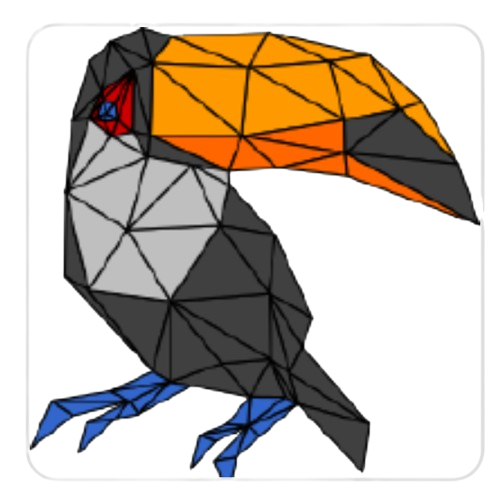

# Tucanos

Tucanos is a 2D and 3D anisotropic mesh adaptation library. It is based on the principles described in "Four-Dimensional Anisotropic Mesh Adaptation for Spacetime Numerical Simulations" by Philip Claude Caplan.

The project is enterily coded in Rust, but it also has a Python interface.

You can find more information and the source code for Tucanos on its official GitHub repository: <https://github.com/tucanos/tucanos>.

 

